# Information Architecture: Emotional Balance (Нейро-Психолог 24/7)

## 1. Введение

### 1.1 Назначение документа

Настоящий документ определяет информационную архитектуру (IA) платформы **Emotional Balance** — ИИ-платформы психологической поддержки 24/7 через Telegram WebApp. Документ описывает структуру контента, систему навигации, иерархию экранов, маршруты пользователей и правила маркировки для всех типов пользователей (B2C, B2B, Психологи, Администраторы).

### 1.2 Контекст платформы

| Параметр | Значение |
|----------|----------|
| Платформа | Telegram WebApp (Mini App) |
| SDK | Telegram WebApp SDK 6.0+ |
| Навигация | MainButton, BackButton (нет browser navigation) |
| Целевая аудитория | 6 персон, 3 тарифа (Free/Standard/Premium), B2B/B2C |
| Модулей | 18 FR (14 P0 + 4 P1) |
| User Stories | 47 (37 P0 + 10 P1) |
| Эпиков | 18 |
| Язык интерфейса | Русский, обращение на «ты» |

### 1.3 Связанные документы

| Документ | Путь |
|----------|------|
| PRD | `docs/discovery/prd.md` |
| User Stories | `docs/discovery/user-stories.md` |
| Business Rules | `docs/discovery/business-rules.md` |
| Tracking Plan | `docs/discovery/tracking-plan.md` |
| Vision | `docs/discovery/vision.md` |

---

## 2. Принципы информационной архитектуры

### 2.1 Основные принципы

| # | Принцип | Описание |
|---|---------|----------|
| P1 | **Mobile-first** | Telegram WebApp работает внутри мобильного клиента. Каждый экран оптимизирован для вертикального viewport 360-428px |
| P2 | **Максимум 3 уровня вложенности** | Пользователь не должен делать более 3 тапов для доступа к любой функции. L0 (Tab) -> L1 (Section) -> L2 (Detail) |
| P3 | **SOS всегда доступен** | Кнопка SOS (Floating Action Button) видна на каждом экране, поверх любого контента, включая tab bar. Z-index: максимальный. Никогда не блокируется тарифом |
| P4 | **Прогрессивное раскрытие** | Показывать только релевантный контент. Сложные функции раскрываются по мере использования |
| P5 | **Предсказуемость** | Навигация и расположение элементов одинаковы на всех экранах. BackButton всегда возвращает на предыдущий экран |
| P6 | **Терапевтическая безопасность** | Disclaimer виден на экранах с терапевтическим контентом. Кризисные элементы приоритизированы |
| P7 | **Тарифная прозрачность** | Заблокированные функции отмечены иконкой замка с указанием требуемого тарифа |

### 2.2 Ограничения Telegram WebApp

| Ограничение | Влияние на IA |
|-------------|---------------|
| Нет browser back/forward | Навигация только через BackButton SDK и tab bar |
| Нет адресной строки | Deep links обрабатываются через Telegram Bot |
| MainButton — одна кнопка внизу | Используется для primary action на экране |
| Viewport ограничен | Контент скроллится, tab bar фиксирован |
| Нет системных шторок | Модальные окна — кастомные |
| Ограниченные жесты | Только tap, scroll, swipe (ограниченно) |

### 2.3 Модель доступа по тарифам

```
                    Free        Standard      Premium       B2B
                    ----        --------      -------       ---
Чат ИИ              5/день     Безлимит      Безлимит+     По плану
Голос               ---        30 мин/день   Безлимит      По плану
Дневник             1/день     Безлимит      Безлимит+     Безлимит
КПТ-упражнения      1/день     Безлимит      Безлимит+     Безлимит
Медитации           1 базовая  Базовый кат.  Полный кат.   Полный
Маркетплейс         Просмотр   Запись -5%    Запись -10%   Запись
Wearables           ---        ---           Да            Да
Мини-курсы          1 курс     Все           Все           Все
Реферальная         Да         Да            Да            ---
Геймификация        Да         Да            Да            Да
SOS-протоколы       Да         Да            Да            Да
Кризис-детектор     Да         Да            Да            Да
```

---

## 3. Sitemap (Полная карта приложения)

### 3.1 Общая структура

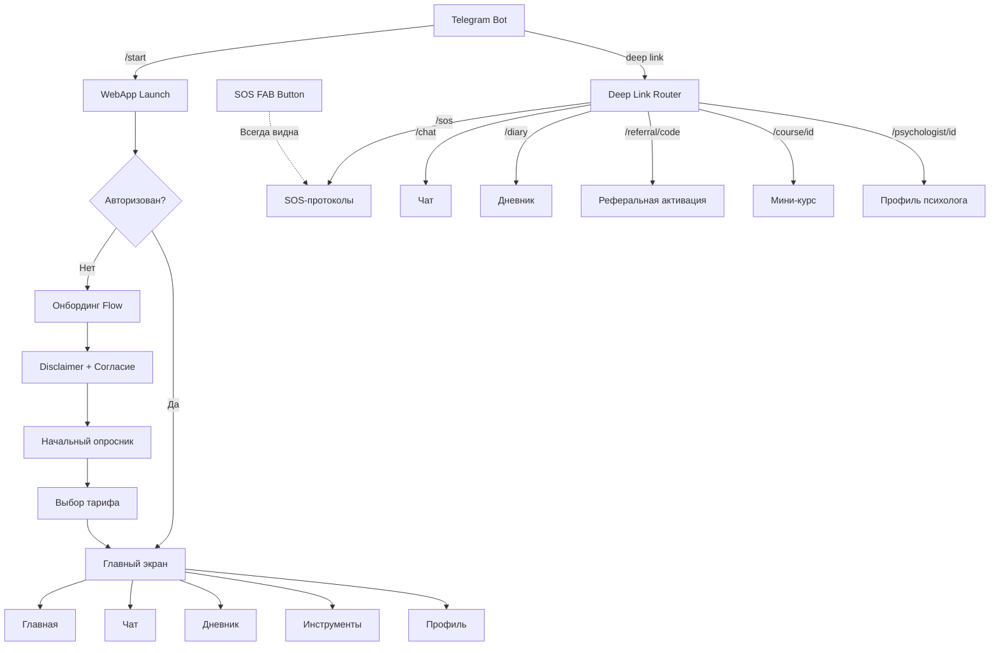

### 3.2 Level 0: Точка входа

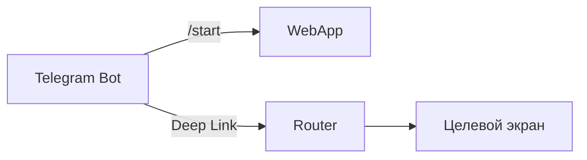

| Точка входа | Маршрут | Целевой экран |
|-------------|---------|---------------|
| `/start` | Онбординг или Главная | Зависит от статуса авторизации |
| `/sos` | Прямой доступ | SOS-протоколы (выбор ситуации) |
| `/chat` | Прямой доступ | Экран чата (новая или последняя сессия) |
| `/diary` | Прямой доступ | Дневник (лента записей) |
| `/referral/{code}` | Обработка кода | Онбординг с реферальным бонусом |
| `/course/{id}` | Прямой доступ | Страница мини-курса |
| `/psychologist/{id}` | Прямой доступ | Профиль психолога в маркетплейсе |

### 3.3 Level 1: Основные разделы (Tab Bar)

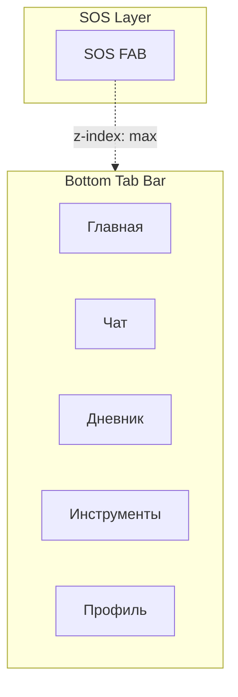

| Таб | Иконка | Label | FR-модули |
|-----|--------|-------|-----------|
| Главная | Home | Главная | FR-018 (дерево), FR-004 (mood), FR-014 (SOS) |
| Чат | Chat bubble | Чат | FR-002, FR-003, FR-006 |
| Дневник | Book | Дневник | FR-004, FR-009 |
| Инструменты | Grid | Инструменты | FR-005, FR-008, FR-016 |
| Профиль | Person | Профиль | FR-012, FR-010, FR-017 |

### 3.4 Level 2: Подразделы по каждому табу

#### 3.4.1 Главная (Dashboard)

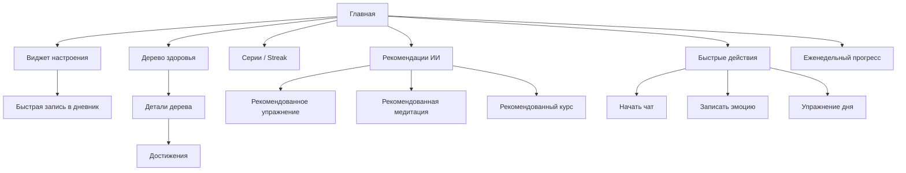

| Элемент | Описание | Приоритет отображения |
|---------|----------|----------------------|
| Виджет настроения | Текущий mood-score + быстрый ввод | 1 (top) |
| Серия (Streak) | Текущие streak-счётчики | 2 |
| Рекомендации ИИ | Персональные подсказки | 3 |
| Быстрые действия | Кнопки: Чат, Дневник, Упражнение | 4 |
| Дерево здоровья | Визуальный прогресс-виджет | 5 |
| Еженедельный прогресс | Краткая сводка за неделю | 6 |

#### 3.4.2 Чат

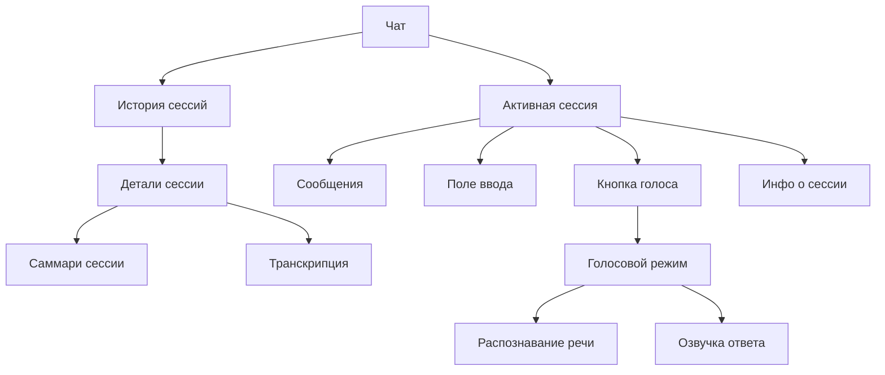

| Экран | Описание | Уровень |
|-------|----------|---------|
| Чат (главный) | Список сессий + кнопка «Новая сессия» | L1 |
| Активная сессия | Чат-интерфейс с сообщениями | L2 |
| Голосовой режим | Переключение на голосовой ввод/вывод | L2 (overlay) |
| Саммари сессии | Краткое содержание после завершения | L3 |
| Транскрипция | Текстовая версия голосовой сессии | L3 |

#### 3.4.3 Дневник

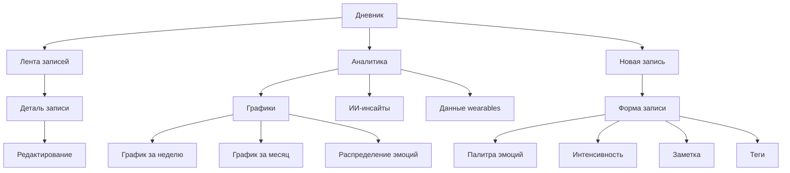

| Экран | Описание | Уровень |
|-------|----------|---------|
| Дневник (главный) | Лента записей + кнопка добавления | L1 |
| Новая запись | Форма: эмоция + интенсивность + заметка + теги | L2 |
| Деталь записи | Полная информация о записи | L2 |
| Аналитика | Графики, распределение, тренды | L2 |
| ИИ-инсайты | Обнаруженные паттерны и рекомендации | L3 |
| Данные wearables | HR/HRV/сон из носимых устройств | L3 |

#### 3.4.4 Инструменты

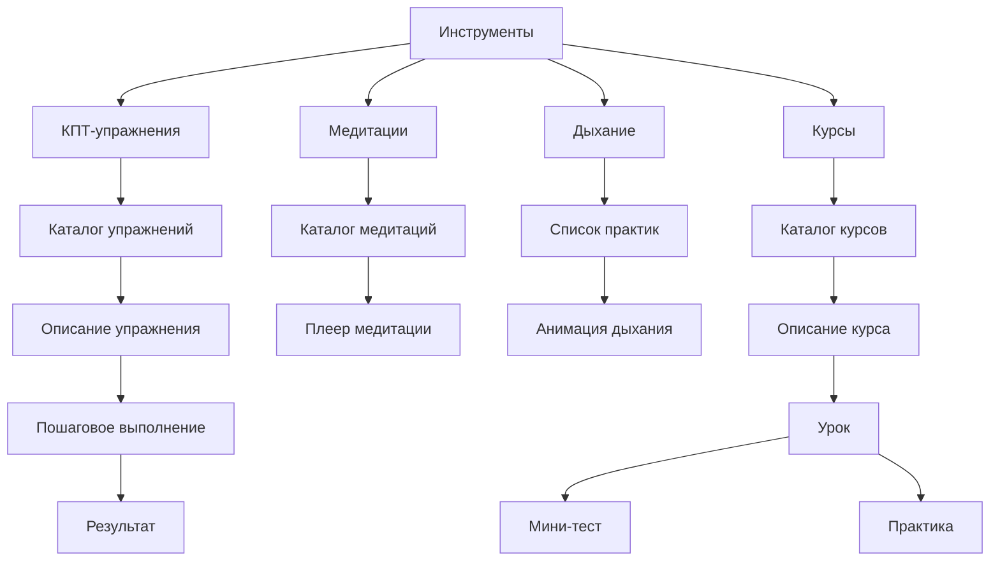

| Вкладка | Содержимое | FR |
|---------|-----------|-----|
| КПТ-упражнения | Каталог по категориям: когнитивное реструктурирование, поведенческая активация, экспозиция, решение проблем, релаксация | FR-005 |
| Медитации | Каталог по категориям: расслабление, сон, тревога, фокус, утренняя, body-scan | FR-008 |
| Дыхание | Дыхательные практики: 4-7-8, квадратное, диафрагмальное | FR-008 |
| Курсы | Мини-курсы: основы КПТ, управление тревогой, EQ, сон, стресс, самооценка | FR-016 |

#### 3.4.5 Профиль

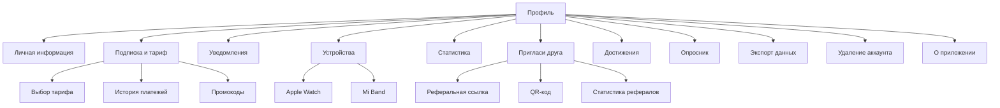

| Экран | Описание | Уровень |
|-------|----------|---------|
| Профиль (главный) | Список настроек и разделов | L1 |
| Личная информация | Имя, аватар (из Telegram) | L2 |
| Подписка и тариф | Текущий план, управление, история | L2 |
| Уведомления | Настройки push, время, частота | L2 |
| Устройства | Подключение Apple Watch / Mi Band | L2 |
| Статистика | Сессии, дневник, упражнения | L2 |
| Пригласи друга | Ссылка, QR, шаринг, статистика | L2 |
| Достижения | Полная коллекция достижений | L2 |
| Экспорт данных | Запрос на выгрузку (ФЗ-152) | L2 |
| Удаление аккаунта | Двойное подтверждение | L2 |

### 3.5 Level 2-3: SOS-протоколы (отдельный flow)

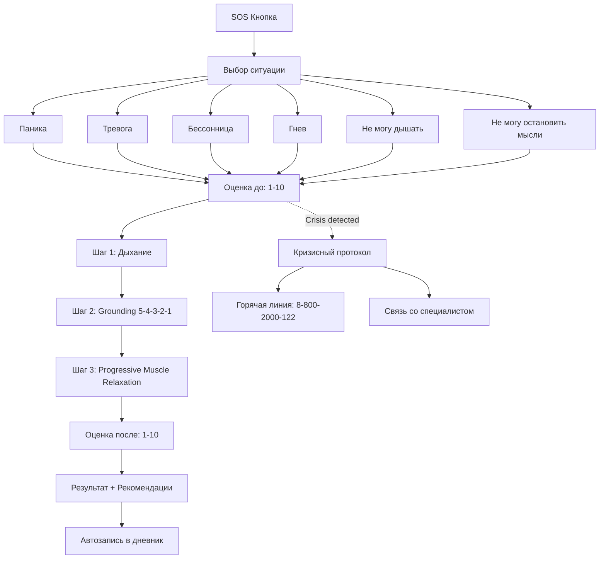

### 3.6 Маркетплейс психологов (Secondary Nav)

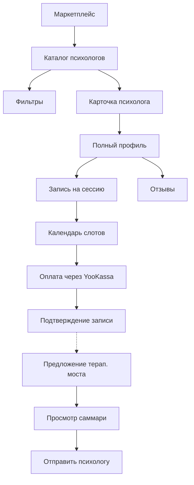

---

## 4. Навигация

### 4.1 Primary Navigation: Bottom Tab Bar

```
+--------+--------+--------+--------+--------+
| Главная|  Чат   |Дневник |Инстру- |Профиль |
|  [Home]|  [Msg] | [Book] |менты   | [User] |
|        |        |        | [Grid] |        |
+--------+--------+--------+--------+--------+
                    [ SOS ]   <-- FAB поверх tab bar
```

| Элемент | Поведение |
|---------|-----------|
| Активный таб | Подсвечен цветом акцента, label bold |
| Неактивный таб | Серый, label regular |
| Badge на табе | Красная точка при непрочитанных (чат — новые рекомендации) |
| Переключение | Мгновенное, без анимации перехода |
| Scroll position | Сохраняется при возврате на таб |

### 4.2 SOS Button: Floating Action Button

| Параметр | Значение |
|----------|----------|
| Тип | Floating Action Button (FAB) |
| Позиция | Right bottom, выше tab bar на 16px |
| Z-index | Максимальный (9999) |
| Размер | 56x56dp |
| Цвет | Красный (emergency) |
| Иконка | Крест / сердцебиение |
| Label | «SOS» |
| Видимость | ВСЕГДА видна на КАЖДОМ экране |
| Тарифная блокировка | НИКОГДА не блокируется (CON-005) |
| Анимация | Пульсация при кризисных триггерах (TRG-001) |
| Действие | 1 тап -> экран выбора ситуации |

### 4.3 Secondary Navigation (через Профиль или Hamburger)

Доступ к дополнительным разделам через экран Профиля (список):

| Раздел | Доступ | Описание |
|--------|--------|----------|
| Маркетплейс | Профиль -> Найти психолога | Каталог верифицированных специалистов |
| Мини-курсы | Инструменты -> Курсы (tab) | Обучающие модули |
| Wearables | Профиль -> Устройства | Подключение Apple Watch / Mi Band |
| B2B Панель | Профиль -> Компания (если B2B HR) | HR-аналитика, сотрудники |
| Реферальная | Профиль -> Пригласи друга | Ссылка, QR, статистика |
| Достижения | Профиль -> Достижения (или Dashboard -> Дерево) | Коллекция достижений |

### 4.4 Telegram SDK Navigation

| Элемент | Поведение | Когда используется |
|---------|-----------|-------------------|
| **BackButton** | Верхний левый угол WebApp. Возвращает на предыдущий экран в стеке | Все экраны кроме L1 (main tabs) |
| **MainButton** | Нижняя кнопка Telegram. Primary action текущего экрана | Формы, подтверждения, запуск действий |
| Haptic Feedback | `HapticFeedback.impactOccurred('medium')` | SOS tap, кризисные действия, достижения |
| Закрытие WebApp | Свайп вниз или кнопка «X» | Выход из приложения |

#### Поведение BackButton по экранам

| Экран | BackButton |
|-------|-----------|
| Главная (Dashboard) | Скрыт (корневой экран) |
| Чат (таб) | Скрыт (корневой экран) |
| Активная чат-сессия | Виден -> Список сессий |
| Дневник (таб) | Скрыт (корневой экран) |
| Новая запись дневника | Виден -> Лента дневника |
| Инструменты (таб) | Скрыт (корневой экран) |
| Выполнение упражнения | Виден -> Каталог (с подтверждением прерывания) |
| Профиль (таб) | Скрыт (корневой экран) |
| Подписка | Виден -> Профиль |
| SOS (выбор ситуации) | Виден -> Предыдущий экран |
| SOS (протокол) | Скрыт (нельзя случайно выйти из протокола) |
| Маркетплейс | Виден -> Профиль |
| Профиль психолога | Виден -> Каталог |

#### Поведение MainButton по экранам

| Экран | MainButton текст | Действие |
|-------|-----------------|----------|
| Онбординг (опросник) | «Продолжить» / «Пропустить» | Следующий шаг |
| Выбор тарифа | «Выбрать» | Переход к оплате |
| Чат (активная сессия) | Скрыт (есть input field) | -- |
| Новая запись дневника | «Сохранить» | Сохранение записи |
| Выполнение упражнения | «Далее» | Следующий шаг |
| SOS-протокол | «Далее» | Следующий шаг протокола |
| Запись к психологу | «Записаться» | Переход к оплате |
| Пригласи друга | «Поделиться» | Telegram Share |

### 4.5 Deep Link Routing

| Deep Link | Маршрут | Условия |
|-----------|---------|---------|
| `t.me/EmotionalBalanceBot?start=sos` | SOS -> Выбор ситуации | Всегда доступен |
| `t.me/EmotionalBalanceBot?start=chat` | Чат -> Новая сессия | Авторизация |
| `t.me/EmotionalBalanceBot?start=diary` | Дневник -> Новая запись | Авторизация |
| `t.me/EmotionalBalanceBot?start=ref_{code}` | Онбординг с реферальным кодом | Новый пользователь |
| `t.me/EmotionalBalanceBot?start=course_{id}` | Инструменты -> Курс -> Описание | Авторизация + доступ по тарифу |
| `t.me/EmotionalBalanceBot?start=psych_{id}` | Маркетплейс -> Профиль психолога | Авторизация |
| `t.me/EmotionalBalanceBot?start=achievement` | Профиль -> Достижения | Авторизация (для шаринга) |

---

## 5. Content Hierarchy по экранам

### 5.1 Dashboard (Главная)

```
+-------------------------------------------------+
| [BackButton: скрыт]           [Уведомления bell] |
+-------------------------------------------------+
| Привет, {имя}!                                   |
|                                                   |
| +---------------------------------------------+ |
| | Как ты себя чувствуешь?                      | |
| | [Эмоция slider/picker]  [Записать]           | |
| +---------------------------------------------+ |
|                                                   |
| +------+  +------+  +------+                     |
| |Днев. |  |Упр.  |  |Медит.|   <-- streak cards  |
| |12 дн.|  |5 дн. |  |3 дн. |                     |
| +------+  +------+  +------+                     |
|                                                   |
| Рекомендации для тебя                             |
| +---------------------------------------------+ |
| | [icon] Попробуй упражнение «Дневник мыслей» | |
| | [icon] Медитация для расслабления (5 мин)    | |
| +---------------------------------------------+ |
|                                                   |
| Быстрые действия                                 |
| [Начать чат]  [Записать эмоцию]  [Упражнение]    |
|                                                   |
| +---------------------------------------------+ |
| |        [Дерево здоровья]                     | |
| |      Уровень: Молодое дерево                 | |
| |      Листьев: 42  Цветов: 12                 | |
| +---------------------------------------------+ |
|                                                   |
| Твоя неделя                                      |
| +---------------------------------------------+ |
| | Сессий: 5 | Записей: 7 | Упражнений: 3      | |
| +---------------------------------------------+ |
|                                                   |
+-------------------------------------------------+
|                  [ SOS ]                          |
| [Главная] [Чат] [Дневник] [Инструменты] [Профиль]|
+-------------------------------------------------+
```

**Приоритеты отображения:**

1. Виджет настроения (mood input) -- побуждение к действию
2. Streak-карточки -- мотивация через серии
3. Рекомендации ИИ -- персонализированный контент
4. Быстрые действия -- навигация к ключевым функциям
5. Дерево здоровья -- визуализация прогресса
6. Еженедельная сводка -- ретроспектива

### 5.2 Чат (Chat)

```
+-------------------------------------------------+
| [BackButton]                    [Голос/Текст]     |
+-------------------------------------------------+
| ИИ-Психолог                     [Инфо о сессии]  |
+-------------------------------------------------+
|                                                   |
| [ИИ]: Привет! Как прошёл твой день?              |
|                                                   |
|           [Пользователь]: Было тяжело на работе  |
|                                                   |
| [ИИ]: Понимаю, расскажи подробнее...             |
| [typing indicator / streaming]                    |
|                                                   |
|                                                   |
|                                                   |
+-------------------------------------------------+
| [Ввод сообщения...]        [Микрофон] [Отправить]|
+-------------------------------------------------+
|                  [ SOS ]                          |
| [Главная] [Чат] [Дневник] [Инструменты] [Профиль]|
+-------------------------------------------------+
```

**Приоритеты:**

1. Сообщения (лента чата) -- основной контент
2. Поле ввода + кнопки -- основное действие
3. Информация о сессии (время, счётчик сообщений) -- контекст
4. Переключатель голос/текст -- модальное переключение

### 5.3 Дневник (Diary)

```
+-------------------------------------------------+
| [BackButton: скрыт]    [Аналитика]    [+Запись]  |
+-------------------------------------------------+
| Дневник эмоций                                    |
+-------------------------------------------------+
| Сегодня                                           |
| +---------------------------------------------+ |
| | 21:30  Тревога  |||||||..  7/10              | |
| | "Переживаю из-за завтрашнего совещания"      | |
| | [работа] [стресс]                            | |
| +---------------------------------------------+ |
|                                                   |
| Вчера                                             |
| +---------------------------------------------+ |
| | 20:00  Спокойствие  ||||....  4/10           | |
| | "Хороший вечер с семьёй"                     | |
| | [отношения]                                  | |
| +---------------------------------------------+ |
| +---------------------------------------------+ |
| | 09:15  Радость  ||||||..  6/10               | |
| | [SOS] Результат: было 8 -> стало 4           | |
| | [sos] [тревога]                              | |
| +---------------------------------------------+ |
|                                                   |
+-------------------------------------------------+
|                  [ SOS ]                          |
| [Главная] [Чат] [Дневник] [Инструменты] [Профиль]|
+-------------------------------------------------+
```

**Приоритеты:**

1. Timeline записей -- хронологическая лента
2. Кнопка добавления (+) -- побуждение к записи
3. Переход в аналитику -- insights и графики
4. Теги и контекст записи -- категоризация

### 5.4 Инструменты (Tools)

```
+-------------------------------------------------+
| [BackButton: скрыт]                               |
+-------------------------------------------------+
| Инструменты                                       |
| +--------+--------+--------+--------+            |
| | КПТ    | Медит. | Дыхание| Курсы  |  <-- tabs  |
| +--------+--------+--------+--------+            |
+-------------------------------------------------+
|                                                   |
| Рекомендовано для тебя                            |
| +---------------------------------------------+ |
| | [icon] Дневник мыслей          15 мин        | |
| |        Когнитивное реструктурирование        | |
| +---------------------------------------------+ |
|                                                   |
| Все упражнения                                    |
| +---------------------------------------------+ |
| | Когнитивное реструктурирование               | |
| |   - Дневник мыслей                           | |
| |   - ABC-анализ                               | |
| |   - Декатастрофизация                        | |
| +---------------------------------------------+ |
| +---------------------------------------------+ |
| | Поведенческая активация                      | |
| |   - Планирование приятных событий            | |
| |   - Пошаговое приближение                    | |
| +---------------------------------------------+ |
| +---------------------------------------------+ |
| | Релаксация                                   | |
| |   - Прогрессивная мышечная                   | |
| |   - Визуализация безопасного места      [lock]| |
| +---------------------------------------------+ |
|                                                   |
+-------------------------------------------------+
|                  [ SOS ]                          |
| [Главная] [Чат] [Дневник] [Инструменты] [Профиль]|
+-------------------------------------------------+
```

**Приоритеты:**

1. Вкладки (tabs) -- переключение между типами инструментов
2. Рекомендация ИИ -- персонализированный подбор
3. Каталог по категориям -- browsing

### 5.5 Профиль (Profile)

```
+-------------------------------------------------+
| [BackButton: скрыт]                               |
+-------------------------------------------------+
| +---+                                             |
| |AVA|  {Имя из Telegram}                         |
| +---+  Тариф: Standard                           |
|         Streak: 12 дней                           |
+-------------------------------------------------+
| Подписка и тариф                           [>]   |
| Уведомления                                [>]   |
| Устройства                                 [>]   |
| Статистика                                 [>]   |
| Достижения                                 [>]   |
| Пригласи друга                             [>]   |
| ---                                               |
| Найти психолога                            [>]   |
| ---                                               |
| Опросник (пройти заново)                   [>]   |
| Экспорт данных                             [>]   |
| О приложении                               [>]   |
| Удалить аккаунт                            [>]   |
+-------------------------------------------------+
|                  [ SOS ]                          |
| [Главная] [Чат] [Дневник] [Инструменты] [Профиль]|
+-------------------------------------------------+
```

---

## 6. Labeling System (Система маркировки)

### 6.1 Общие правила

| Правило | Описание |
|---------|----------|
| Язык | Русский |
| Обращение | На «ты» |
| Регистр | Sentence case (первое слово с большой буквы) |
| Тон | Тёплый, поддерживающий, неформальный |
| Длина | Tab labels -- 1 слово; Section labels -- 1-3 слова; Descriptions -- до 1 строки |

### 6.2 Tab Labels

| Таб | Label | Иконка |
|-----|-------|--------|
| 1 | Главная | Home (house) |
| 2 | Чат | Message bubble |
| 3 | Дневник | Book / Journal |
| 4 | Инструменты | Grid / Toolkit |
| 5 | Профиль | Person |

### 6.3 Section Labels по модулям

| Модуль | Label (главный) | Labels (подразделы) |
|--------|-----------------|---------------------|
| FR-001: Онбординг | «Добро пожаловать» | «Расскажи о себе», «Выбери тариф» |
| FR-002: Чат | «Чат с психологом» | «Новая сессия», «История сессий», «Саммари» |
| FR-003: Голос | «Голосовая сессия» | «Переключить на голос», «Переключить на текст» |
| FR-004: Дневник | «Дневник эмоций» | «Новая запись», «Аналитика», «Инсайты», «Лента записей» |
| FR-005: КПТ | «КПТ-упражнения» | «Каталог», «Мой прогресс», «Рекомендовано для тебя» |
| FR-006: Кризис | «Помощь» | «Позвонить на горячую линию», «Связаться со специалистом» |
| FR-007: Маркетплейс | «Найти психолога» | «Каталог», «Фильтры», «Записаться», «Отзывы» |
| FR-008: Медитации | «Медитации» | «Каталог», «Дыхательные практики» |
| FR-009: Wearables | «Устройства» | «Подключить Apple Watch», «Подключить Mi Band» |
| FR-010: Подписка | «Подписка и тариф» | «Текущий тариф», «Сменить тариф», «История платежей» |
| FR-011: B2B | «Компания» | «Сотрудники», «Аналитика», «Пригласить» |
| FR-012: Профиль | «Профиль» | «Настройки», «Уведомления», «Экспорт данных» |
| FR-014: SOS | «SOS-помощь» | «Паника», «Тревога», «Бессонница», «Гнев», «Не могу дышать», «Не могу остановить мысли» |
| FR-015: Мост | «Подготовка к сессии» | «Саммари для психолога», «Просмотреть», «Отправить» |
| FR-016: Курсы | «Мини-курсы» | «Каталог», «Мой прогресс», «Уроки» |
| FR-017: Реферальная | «Пригласи друга» | «Твоя ссылка», «Статистика», «Поделиться» |
| FR-018: Геймификация | «Достижения» | «Дерево здоровья», «Серии», «Коллекция достижений» |

### 6.4 Action Labels

| Действие | Label | Контекст |
|----------|-------|----------|
| Начать чат | «Начать сессию» | Кнопка на экране чата |
| Запись в дневник | «Записать эмоцию» | Кнопка + на дневнике |
| Начать упражнение | «Начать» | Карточка упражнения |
| Начать медитацию | «Начать» | Карточка медитации |
| SOS | «SOS» | FAB кнопка |
| Оплата | «Оформить подписку» | Экран тарифов |
| Запись к психологу | «Записаться» | Профиль психолога |
| Пригласить друга | «Поделиться» | Экран реферальной |
| Экспорт данных | «Запросить экспорт» | Профиль |
| Удалить аккаунт | «Удалить аккаунт» | Профиль (красный текст) |

### 6.5 Empty States

| Экран | Сообщение | Действие |
|-------|-----------|----------|
| Дневник (пуст) | «Начни вести дневник, чтобы отслеживать свои эмоции» | «Записать эмоцию» |
| Чат (нет сессий) | «Поговори с ИИ-психологом в любое время» | «Начать сессию» |
| Аналитика (мало данных) | «Сделай ещё {N} записей для получения аналитики» | «Записать эмоцию» |
| Достижения (пусто) | «Здесь появятся твои достижения. Начни с дневника!» | «Записать эмоцию» |
| Устройства (не подключены) | «Подключи часы для автоматического мониторинга стресса» | «Подключить устройство» |

### 6.6 Error Labels

| Ситуация | Сообщение | Действие |
|----------|-----------|----------|
| Лимит сообщений | «Лимит сообщений на сегодня исчерпан» | «Перейти на Standard» |
| Лимит записей | «Лимит записей на сегодня исчерпан» | «Перейти на Standard» |
| Нет интернета | «Нет подключения к интернету» | «Повторить» |
| Ошибка оплаты | «Оплата не прошла. Попробуй другой способ» | «Попробовать снова» |
| Ошибка STT | «Не удалось распознать речь. Попробуй снова или переключись на текст» | «Повторить» / «Текст» |
| Graceful degradation | «Некоторые ИИ-функции временно ограничены» | -- |

---

## 7. Tier-Gated Navigation (Навигация по тарифам)

### 7.1 Визуальное обозначение заблокированных функций

| Тариф | Визуал | Пример |
|-------|--------|--------|
| Free -> Standard | Иконка замка + текст | «Доступно на Standard» |
| Free -> Premium | Иконка замка + текст | «Доступно на Premium» |
| Standard -> Premium | Иконка замка + текст | «Доступно на Premium» |

### 7.2 Матрица доступности по экранам

```
Экран / Функция              Free        Standard     Premium
-----------------------------------------------------------------
Главная (Dashboard)          Полный      Полный       Полный
Чат (текст)                  5 msg/day   Безлимит     Безлимит+
Чат (голос)                  [lock]      30 мин/день  Безлимит
Дневник (запись)             1/день      Безлимит     Безлимит
Дневник (аналитика)          Базовая     ИИ-анализ    Расширенная
Дневник (wearables данные)   [lock]      [lock]       Полный
КПТ-упражнения               1/день      Безлимит     Безлимит+
Медитации                    1 базовая   Базовый кат. Полный каталог
Дыхательные практики         Полный      Полный       Полный
Мини-курсы                   1 курс      Все          Все
Маркетплейс (просмотр)      Полный      Полный       Полный
Маркетплейс (запись)         [lock]      -5% скидка   -10% скидка
Wearables                    [lock]      [lock]       Полный
Реферальная                  Полный      Полный       Полный
Геймификация                 Полный      Полный       Полный
SOS-протоколы                Полный      Полный       Полный
Кризис-детектор              Полный      Полный       Полный
```

### 7.3 Поведение при нажатии на заблокированную функцию

```mermaid
graph TD
    TAP[Тап на заблокированную функцию] --> MODAL[Модальное окно]
    MODAL --> INFO[Описание функции]
    INFO --> CTA_TRIAL[«Попробуй бесплатно 7 дней»]
    INFO --> CTA_UPGRADE[«Перейти на {план}»]
    INFO --> CTA_CLOSE[«Не сейчас»]

    CTA_TRIAL --> PAYMENT[Экран оплаты]
    CTA_UPGRADE --> PLAN_SELECT[Выбор тарифа]
    CTA_CLOSE --> BACK[Возврат]
```

### 7.4 Правила (CON-005): SOS никогда не блокируется

```
ASSERT SOS_button.visible == TRUE        # На всех экранах
ASSERT SOS_button.enabled == TRUE        # На всех тарифах
ASSERT SOS_protocols.accessible == TRUE  # Включая Free
ASSERT SOS_button.z_index == MAX         # Поверх всего
```

---

## 8. B2B vs B2C: Различия в IA

### 8.1 Обзор ролей

| Роль | Тип | Особенности IA |
|------|-----|----------------|
| B2C Пользователь | Стандартный | Базовая навигация (5 табов) |
| B2B Сотрудник | Корпоративный | Базовая навигация + корпоративный badge |
| B2B HR-администратор | Корпоративный | Базовая навигация + вкладка «HR Панель» |

### 8.2 B2C: Стандартная навигация

```
[Главная] [Чат] [Дневник] [Инструменты] [Профиль]
                                              |
                                         Пригласи друга
                                         Маркетплейс
                                         Достижения
```

### 8.3 B2B HR-администратор: Расширенная навигация

```
[Главная] [Чат] [Дневник] [Инструменты] [Профиль]
                                              |
                                         HR Панель  <-- дополнительный раздел
                                            |
                                     +------+------+
                                     |             |
                                 Аналитика    Сотрудники
                                     |
                              +------+------+
                              |             |
                         Агрегир.     Ежемесячный
                         метрики       отчёт (PDF)
```

#### HR Панель: Структура

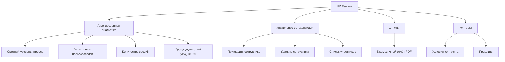

**Ограничения (CON-014):**
- HR НИКОГДА не видит персональные данные сотрудников
- Аналитика только агрегированная (при >= 10 участниках)
- При < 10 участниках аналитика скрыта

### 8.4 B2B Сотрудник

| Элемент | Отличие от B2C |
|---------|----------------|
| Badge | Логотип компании в шапке (если B2B брендирование) |
| Тариф | Определяется корпоративным контрактом |
| Профиль | Пункт «Моя компания» (название, контакт HR) |
| Реферальная | Недоступна (B2B привлечение через HR) |
| Маркетплейс | Скидка по корпоративному тарифу |

---

## 9. Психолог (P5): Отдельная IA панели

### 9.1 Точка входа

Психолог заходит через того же Telegram-бота, но после верификации (CON-020) получает доступ к панели психолога.

### 9.2 Навигация панели психолога

```mermaid
graph TD
    PSYCH_PANEL[Панель психолога] --> PSYCH_PROFILE[Мой профиль]
    PSYCH_PANEL --> SCHEDULE[Расписание]
    PSYCH_PANEL --> CLIENTS[Клиенты]
    PSYCH_PANEL --> REVIEWS_PANEL[Отзывы]
    PSYCH_PANEL --> STATS_PANEL[Статистика]
    PSYCH_PANEL --> BRIDGE_PANEL[Терапевтический мост]

    PSYCH_PROFILE --> EDIT_PROFILE[Редактирование]
    PSYCH_PROFILE --> CERT[Сертификаты]
    PSYCH_PROFILE --> SPECIALIZATIONS[Специализации]
    PSYCH_PROFILE --> PRICE[Цена за сессию]
    PSYCH_PROFILE --> FORMAT[Формат: онлайн/оффлайн]

    SCHEDULE --> WEEK_VIEW[Еженедельный календарь]
    WEEK_VIEW --> SET_AVAILABLE[Установить доступные слоты]
    WEEK_VIEW --> BOOKED[Забронированные слоты]
    WEEK_VIEW --> BLOCK_TIME[Блокировка времени]

    CLIENTS --> CLIENT_LIST[Список клиентов]
    CLIENT_LIST --> CLIENT_DETAIL[Деталь клиента]
    CLIENT_DETAIL --> SESSION_NOTES[Заметки после сессии]

    REVIEWS_PANEL --> REVIEW_LIST[Список отзывов]

    STATS_PANEL --> CONSULTATIONS_COUNT[Количество консультаций]
    STATS_PANEL --> AVG_RATING[Средний рейтинг]
    STATS_PANEL --> INCOME[Доход (за вычетом комиссии)]

    BRIDGE_PANEL --> BRIDGE_LIST[Саммари от ИИ]
    BRIDGE_PANEL --> FEEDBACK_FORM[Обратная связь]
```

### 9.3 Tab Bar психолога

```
+----------+----------+----------+----------+
| Расписание| Клиенты | Статисти-| Профиль  |
|  [Calendar]| [Users] | ка [Chart]|  [User]  |
+----------+----------+----------+----------+
```

| Таб | Label | Содержимое |
|-----|-------|-----------|
| Расписание | Расписание | Еженедельный календарь, слоты, бронирования |
| Клиенты | Клиенты | Список клиентов, саммари от ИИ, заметки |
| Статистика | Статистика | Количество сессий, рейтинг, доход |
| Профиль | Профиль | Редактирование профиля, сертификаты, цена |

### 9.4 Терапевтический мост в панели психолога

| Экран | Описание |
|-------|----------|
| Список саммари | Саммари, полученные от клиентов перед сессиями |
| Детали саммари | Темы из чата, тренды дневника, упражнения, динамика |
| Обратная связь | Форма: заметки по сессии, рекомендации, домашнее задание |

---

## 10. Администратор (P6): Admin Panel IA

### 10.1 Точка входа

Администратор получает доступ через отдельный URL или роль в Telegram-боте. Admin Panel реализована как Django Admin (`/admin/`) с кастомными views.

### 10.2 Структура Admin Panel

```mermaid
graph TD
    ADMIN[Admin Panel] --> LIMITS[Управление лимитами]
    ADMIN --> USERS[Пользователи]
    ADMIN --> CONTENT[Контент]
    ADMIN --> MONITORING[Мониторинг]
    ADMIN --> CRISIS_LOG[Кризисный лог]
    ADMIN --> MARKETPLACE_ADMIN[Маркетплейс]
    ADMIN --> B2B_ADMIN[B2B Клиенты]
    ADMIN --> AUDIT[Аудит-лог]

    LIMITS --> GLOBAL_LIMITS[Глобальные лимиты API]
    LIMITS --> PER_USER_LIMITS[Per-user лимиты]
    LIMITS --> BUDGET[Бюджетные лимиты]
    LIMITS --> LLM_SPLIT[Раздельные лимиты GigaChat/YandexGPT]

    USERS --> USER_LIST[Список пользователей]
    USERS --> USER_DETAIL[Детали пользователя]
    USERS --> USER_SEARCH[Поиск]
    USERS --> USER_BLOCK[Блокировка]

    CONTENT --> EXERCISES_MGMT[Управление упражнениями]
    CONTENT --> MEDITATIONS_MGMT[Управление медитациями]
    CONTENT --> COURSES_MGMT[Управление курсами]
    CONTENT --> CRISIS_MARKERS[Кризисные маркеры]

    MONITORING --> DASHBOARD_ADMIN[Дашборд метрик]
    MONITORING --> LLM_COSTS[Расходы LLM]
    MONITORING --> SYSTEM_HEALTH[Здоровье системы]
    MONITORING --> ALERTS[Алерты]

    CRISIS_LOG --> CRISIS_LIST[Список событий]
    CRISIS_LOG --> CRISIS_DETAIL[Детали события]
    CRISIS_LOG --> OPERATOR_LOG[Лог оператора]

    MARKETPLACE_ADMIN --> VERIFICATION[Верификация психологов]
    MARKETPLACE_ADMIN --> MODERATION[Модерация отзывов]
    MARKETPLACE_ADMIN --> COMMISSIONS[Комиссии]

    B2B_ADMIN --> COMPANIES[Список компаний]
    B2B_ADMIN --> CONTRACTS[Контракты]

    AUDIT --> AUDIT_LOG[AuditLog записи]
    AUDIT --> FILTERS_AUDIT[Фильтры и поиск]
```

### 10.3 Главные разделы Admin Panel

| Раздел | Описание | FR |
|--------|----------|-----|
| Управление лимитами | Глобальные, per-user, бюджетные лимиты. Алерты (80%, 95%, 100%) | FR-013 |
| Пользователи | Список, поиск, детали, блокировка, экспорт | FR-012 |
| Контент | CRUD для упражнений, медитаций, курсов, кризисных маркеров | FR-005, FR-008, FR-016, FR-006 |
| Мониторинг | Real-time дашборд: MAU, MRR, LLM costs, system health | FR-013 |
| Кризисный лог | Все срабатывания детектора, действия операторов | FR-006 |
| Маркетплейс | Верификация дипломов, модерация отзывов, комиссии | FR-007 |
| B2B Клиенты | Компании, контракты, лицензии | FR-011 |
| Аудит-лог | AuditLog: фильтры по уровню, действию, категории, сущности | Core |

---

## 11. Navigation Flows (Mermaid-диаграммы)

### 11.1 Онбординг Flow

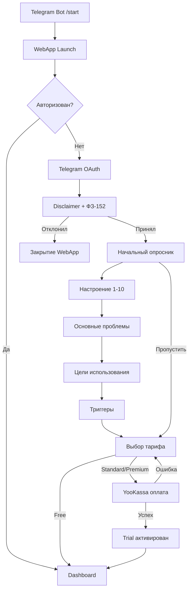

### 11.2 SOS Flow

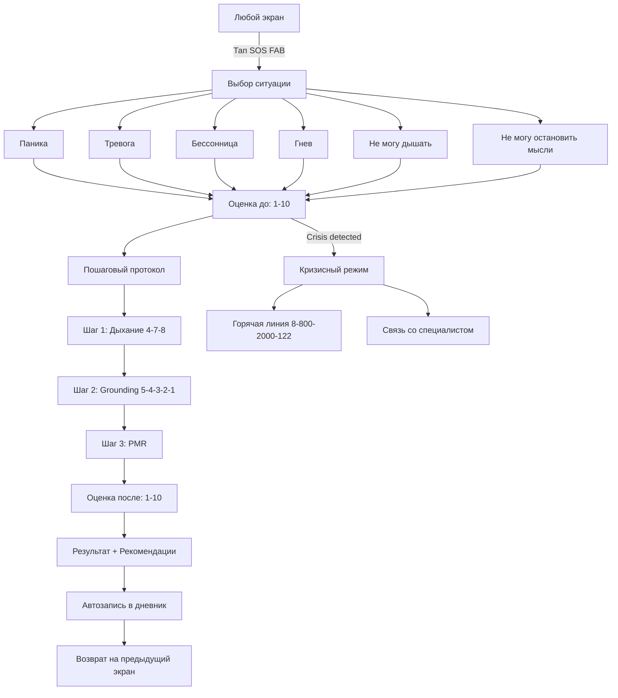

### 11.3 Chat Session Flow

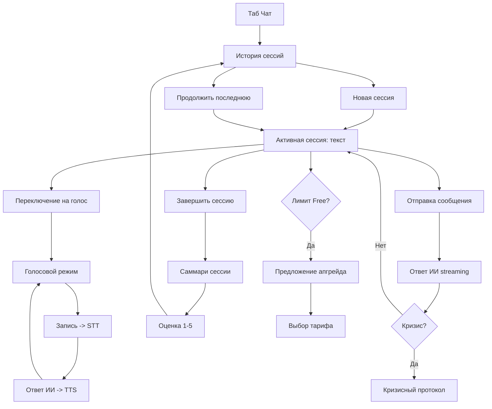

### 11.4 Diary Entry Flow

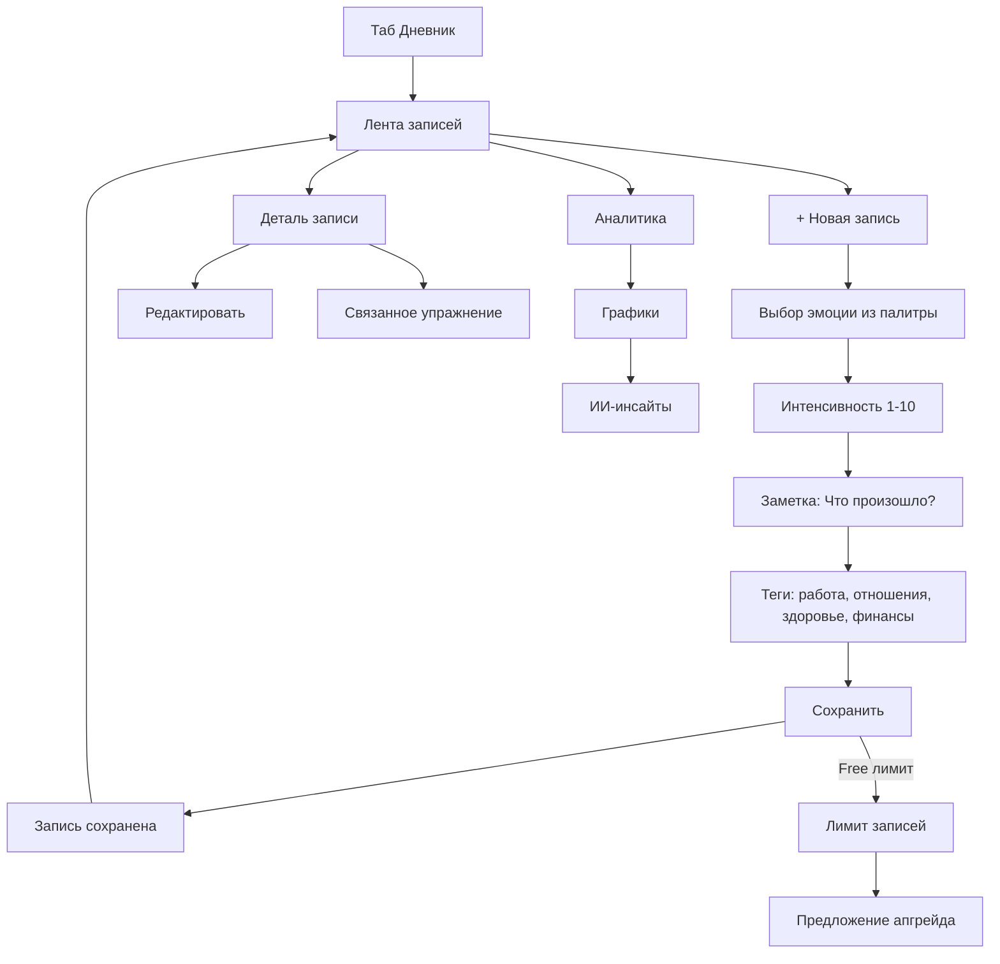

### 11.5 Marketplace Booking Flow

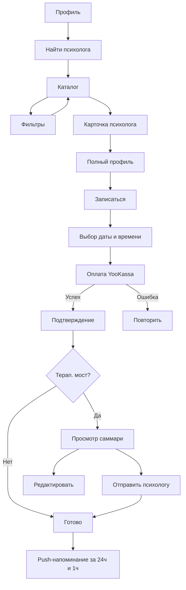

### 11.6 Subscription Upgrade Flow

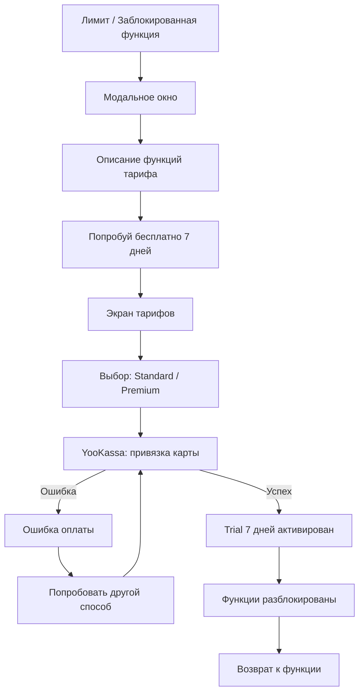

---

## 12. Полная Sitemap (Mermaid)

```mermaid
graph TB
    subgraph Entry["Точки входа"]
        BOT[Telegram Bot]
        DEEP[Deep Links]
    end

    subgraph Auth["Авторизация"]
        LOGIN[Telegram OAuth]
        DISC_SCREEN[Disclaimer]
        SURVEY_SCREEN[Опросник]
        PLAN_SCREEN[Выбор тарифа]
    end

    subgraph Main["Основная навигация"]
        HOME[Главная]
        CHAT[Чат]
        DIARY[Дневник]
        TOOLS[Инструменты]
        PROF[Профиль]
    end

    subgraph SOS_Flow["SOS (всегда доступен)"]
        SOS_BTN[SOS FAB]
        SOS_SEL[Выбор ситуации]
        SOS_PROTO[Протокол]
        SOS_RESULT_SCREEN[Результат]
    end

    subgraph Home_Sub["Главная: подразделы"]
        MOOD_W[Виджет настроения]
        TREE_W[Дерево здоровья]
        STREAK_W[Серии]
        RECS_W[Рекомендации]
        QUICK_W[Быстрые действия]
    end

    subgraph Chat_Sub["Чат: подразделы"]
        SESSIONS[История сессий]
        ACTIVE_CHAT[Активная сессия]
        VOICE[Голосовой режим]
        CHAT_SUMMARY[Саммари]
    end

    subgraph Diary_Sub["Дневник: подразделы"]
        DIARY_TL[Лента записей]
        NEW_ENTRY[Новая запись]
        DIARY_AN[Аналитика]
        DIARY_INS[ИИ-инсайты]
        WEAR_DATA[Данные wearables]
    end

    subgraph Tools_Sub["Инструменты: подразделы"]
        CBT[КПТ-упражнения]
        MED[Медитации]
        BREATH[Дыхание]
        COURSES[Мини-курсы]
    end

    subgraph Profile_Sub["Профиль: подразделы"]
        SUB[Подписка]
        NOTIF[Уведомления]
        DEVS[Устройства]
        STATS[Статистика]
        ACH[Достижения]
        REF[Пригласи друга]
        EXPORT[Экспорт данных]
        DEL[Удаление аккаунта]
    end

    subgraph Secondary["Вторичная навигация"]
        MARKET[Маркетплейс]
        B2B_HR[HR Панель]
    end

    subgraph Psychologist["Панель психолога"]
        P_SCHED[Расписание]
        P_CLIENTS[Клиенты]
        P_STATS[Статистика]
        P_PROF[Профиль]
        P_BRIDGE[Терап. мост]
    end

    subgraph Admin["Admin Panel"]
        A_LIMITS[Лимиты]
        A_USERS[Пользователи]
        A_CONTENT[Контент]
        A_MONITOR[Мониторинг]
        A_CRISIS[Кризисный лог]
        A_MARKET[Маркетплейс]
        A_AUDIT[Аудит]
    end

    BOT --> LOGIN
    DEEP --> Main
    LOGIN --> DISC_SCREEN --> SURVEY_SCREEN --> PLAN_SCREEN --> HOME

    HOME --> Home_Sub
    CHAT --> Chat_Sub
    DIARY --> Diary_Sub
    TOOLS --> Tools_Sub
    PROF --> Profile_Sub
    PROF --> MARKET
    PROF --> B2B_HR

    SOS_BTN --> SOS_SEL --> SOS_PROTO --> SOS_RESULT_SCREEN
```

---

## 13. Traceability Matrix: IA -> FR -> US

| Экран / Раздел | FR | User Stories | Тариф |
|----------------|-----|-------------|-------|
| Онбординг: Регистрация | FR-001 | US-001 | Все |
| Онбординг: Disclaimer | FR-001 | US-002 | Все |
| Онбординг: Опросник | FR-001 | US-003 | Все |
| Онбординг: Тариф | FR-010 | US-004 | Все |
| Dashboard: Виджет настроения | FR-004 | US-010 | Все |
| Dashboard: Дерево здоровья | FR-018 | US-045 | Все |
| Dashboard: Серии | FR-018 | US-047 | Все |
| Dashboard: Рекомендации | FR-002, FR-005 | US-006, US-014 | Все |
| Чат: Текстовая сессия | FR-002 | US-005, US-006 | Free (огр.) / Std+ |
| Чат: Голосовая сессия | FR-003 | US-008, US-009 | Std / Prem |
| Чат: Саммари | FR-002 | US-007 | Std+ |
| Дневник: Лента записей | FR-004 | US-010 | Free (огр.) / Std+ |
| Дневник: Аналитика | FR-004 | US-011, US-012 | Std+ (ИИ) |
| Дневник: Напоминания | FR-004 | US-013 | Все |
| Инструменты: КПТ-каталог | FR-005 | US-014 | Free (огр.) / Std+ |
| Инструменты: Выполнение | FR-005 | US-015, US-016 | Free (огр.) / Std+ |
| Инструменты: Медитации | FR-008 | US-022, US-023 | Free (огр.) / Prem |
| Инструменты: Дыхание | FR-008 | US-024 | Все |
| Инструменты: Курсы | FR-016 | US-042, US-043 | Free (огр.) / Std+ |
| SOS: Кнопка | FR-014 | US-038 | Все (CON-005) |
| SOS: Протокол | FR-014 | US-038, US-039 | Все (CON-005) |
| Кризис: Детектор | FR-006 | US-017 | Все (CON-004) |
| Маркетплейс: Каталог | FR-007 | US-018 | Просмотр: все |
| Маркетплейс: Запись | FR-007 | US-019 | Std+ |
| Маркетплейс: Отзывы | FR-007 | US-021 | Std+ |
| Терап. мост: Саммари | FR-015 | US-040 | Std+ |
| Терап. мост: Обратная связь | FR-015 | US-041 | Std+ |
| Профиль: Управление | FR-012 | US-032 | Все |
| Профиль: Удаление | FR-012 | US-033 | Все |
| Профиль: Экспорт | FR-012 | US-034 | Все |
| Подписка: Оплата | FR-010 | US-028 | -- |
| Подписка: Управление | FR-010 | US-029 | Std+ |
| Wearables: Подключение | FR-009 | US-025, US-026 | Prem |
| Wearables: Алерт стресса | FR-009 | US-027 | Prem |
| B2B: Группа | FR-011 | US-030 | B2B |
| B2B: Аналитика | FR-011 | US-031 | B2B HR |
| Лимиты: Панель | FR-013 | US-035 | Admin |
| Лимиты: Алерты | FR-013 | US-036 | Admin |
| Лимиты: Degradation | FR-013 | US-037 | Все |
| Реферальная | FR-017 | US-044 | B2C |
| Геймификация: Дерево | FR-018 | US-045 | Все |
| Геймификация: Достижения | FR-018 | US-046 | Все |
| Геймификация: Серии | FR-018 | US-047 | Все |
| Психолог: Панель | FR-007 | US-020 | P5 |

---

## 14. Сводная статистика IA

| Показатель | Значение |
|-----------|----------|
| Уровней навигации | 3 (L0: Tab -> L1: Section -> L2: Detail) |
| Табов в Primary Nav | 5 |
| Экранов L1 (основные разделы) | 5 |
| Экранов L2 (подразделы) | 38 |
| Экранов L3 (деталь) | 22 |
| Всего уникальных экранов | ~65 |
| SOS-ситуаций | 6 |
| Deep Links | 7 |
| Тарифных уровней | 3 (Free / Standard / Premium) + B2B |
| Ролей пользователей | 4 (B2C, B2B Employee, B2B HR, Психолог) + Admin |
| Mermaid-диаграмм | 16 |

---

## 15. Глоссарий IA-терминов

| Термин | Определение |
|--------|------------|
| **IA** | Information Architecture -- организация и структурирование контента в приложении |
| **Sitemap** | Визуальная карта всех экранов и их иерархии |
| **Tab Bar** | Нижняя навигационная панель с основными разделами |
| **FAB** | Floating Action Button -- плавающая кнопка поверх контента |
| **Deep Link** | Прямая ссылка на конкретный экран через Telegram Bot |
| **L0 / L1 / L2 / L3** | Уровни вложенности: L0 (вход), L1 (таб), L2 (подраздел), L3 (деталь) |
| **Tier-Gated** | Функция, доступная только на определённом тарифе |
| **BackButton** | Кнопка возврата в Telegram WebApp SDK (верхний левый угол) |
| **MainButton** | Основная кнопка действия в Telegram WebApp SDK (нижняя) |
| **Progressive Disclosure** | Паттерн: показывать информацию постепенно, по мере необходимости |
| **Empty State** | Состояние экрана при отсутствии данных |
| **Badge** | Индикатор (точка или число) на элементе навигации |
| **Graceful Degradation** | Мягкая деградация функций при ограничении ресурсов |

---

## 16. Чеклист верификации IA

### Для Review Agent

- [ ] Все 18 FR-модулей представлены в Sitemap
- [ ] Все 47 User Stories имеют соответствующий экран
- [ ] SOS-кнопка доступна на каждом экране (CON-005)
- [ ] Кризис-детектор работает на всех тарифах (CON-004)
- [ ] Максимум 3 уровня вложенности для любой функции
- [ ] BackButton корректно определён для каждого экрана
- [ ] MainButton корректно определён для каждого экрана
- [ ] Все deep links маршрутизированы
- [ ] Tier-gated функции отмечены иконкой замка
- [ ] B2B HR имеет отдельную панель с агрегированной аналитикой
- [ ] Психолог (P5) имеет отдельную IA панели
- [ ] Администратор (P6) имеет отдельную IA admin panel
- [ ] Empty states определены для всех основных экранов
- [ ] Labeling system на русском, обращение на «ты»
- [ ] Disclaimer виден на экранах с терапевтическим контентом

---

## 17. Ссылки

| Документ | Путь |
|----------|------|
| PRD | `docs/discovery/prd.md` |
| User Stories | `docs/discovery/user-stories.md` |
| Business Rules | `docs/discovery/business-rules.md` |
| Tracking Plan | `docs/discovery/tracking-plan.md` |
| Vision | `docs/discovery/vision.md` |

---

*Документ создан: UX Agent | Дата: 2026-02-04*
