# User Flows: Emotional Balance (Нейро-Психолог 24/7)

## Содержание

- [1. Обзор и принципы проектирования](#1-обзор-и-принципы-проектирования)
- [2. Ограничения Telegram WebApp](#2-ограничения-telegram-webapp)
- [3. Safety-Critical Flows](#3-safety-critical-flows)
  - [UF-SOS: SOS-протоколы быстрой помощи](#uf-sos-sos-протоколы-быстрой-помощи)
  - [UF-CRISIS: Кризис-детектор](#uf-crisis-кризис-детектор)
- [4. Онбординг](#4-онбординг)
  - [UF-ONBOARD: Регистрация и онбординг](#uf-onboard-регистрация-и-онбординг)
- [5. Основные функции (P0)](#5-основные-функции-p0)
  - [UF-CHAT: AI-чат](#uf-chat-ai-чат)
  - [UF-VOICE: Голосовые сессии](#uf-voice-голосовые-сессии)
  - [UF-DIARY: Дневник эмоций](#uf-diary-дневник-эмоций)
  - [UF-CBT: КПТ-упражнения](#uf-cbt-кпт-упражнения)
  - [UF-MARKETPLACE: Маркетплейс психологов](#uf-marketplace-маркетплейс-психологов)
  - [UF-MEDITATION: Медитации и дыхание](#uf-meditation-медитации-и-дыхание)
  - [UF-WEARABLES: Носимые устройства](#uf-wearables-носимые-устройства)
  - [UF-PAYMENT: Подписки и платежи](#uf-payment-подписки-и-платежи)
  - [UF-B2B: Корпоративное управление](#uf-b2b-корпоративное-управление)
  - [UF-PROFILE: Профиль и настройки](#uf-profile-профиль-и-настройки)
  - [UF-LIMITS: Система лимитов](#uf-limits-система-лимитов)
- [6. Новые фичи (P1)](#6-новые-фичи-p1)
  - [UF-BRIDGE: Терапевтический мост](#uf-bridge-терапевтический-мост)
  - [UF-COURSES: Мини-курсы](#uf-courses-мини-курсы)
  - [UF-REFERRAL: Реферальная программа](#uf-referral-реферальная-программа)
  - [UF-GAMIFICATION: Геймификация](#uf-gamification-геймификация)
- [7. Сводная таблица](#7-сводная-таблица)

---

## 1. Обзор и принципы проектирования

### 1.1 Подход

User Flows для Emotional Balance проектируются с учётом трёх приоритетов:

1. **Safety-first** — кризисные и SOS-flow имеют наивысший приоритет и минимальное количество шагов.
2. **Telegram-native** — все flow учитывают ограничения Telegram WebApp SDK.
3. **Персонализация** — flow адаптируются под персону, тариф и контекст пользователя.

### 1.2 Принципы (Nielsen's 10 Heuristics)

| # | Эвристика | Применение в Emotional Balance |
|---|-----------|-------------------------------|
| H1 | Видимость статуса системы | Индикаторы загрузки, streaming-вывод ответа ИИ, прогресс-бары в упражнениях |
| H2 | Соответствие реальному миру | Терминология wellness (не клиническая), эмоджи-палитра эмоций, понятные метафоры |
| H3 | Пользовательский контроль и свобода | Кнопка «Назад» через BackButton, возможность прервать упражнение, отмена действий |
| H4 | Консистентность и стандарты | Единый design system, одинаковые паттерны навигации во всех разделах |
| H5 | Предотвращение ошибок | Подтверждение удаления аккаунта (двойное), валидация форм, предупреждение о лимитах |
| H6 | Узнавание вместо запоминания | Визуальная палитра эмоций, иконки категорий, рекомендации ИИ на главном экране |
| H7 | Гибкость и эффективность | SOS — 1 тап, быстрый доступ к дневнику через push, hot-keys для частых действий |
| H8 | Эстетика и минимализм | Чистый интерфейс, минимум элементов на экране, фокус на контенте |
| H9 | Помощь в распознавании ошибок | Понятные сообщения об ошибках, предложение альтернатив (оффлайн-режим, текст вместо голоса) |
| H10 | Справка и документация | Onboarding-подсказки, tooltip-и, FAQ в профиле |

### 1.3 Персоны и их приоритетные flow

| Персона | Приоритетные flow | Тариф |
|---------|-------------------|-------|
| Аня (28, тревожность) | UF-SOS, UF-CHAT, UF-DIARY, UF-MEDITATION | Standard |
| Дмитрий (35, выгорание) | UF-CHAT, UF-VOICE, UF-CBT, UF-WEARABLES | Premium |
| Марина (40, HR) | UF-B2B, UF-LIMITS | B2B |
| Олег (32, регион) | UF-DIARY, UF-MARKETPLACE, UF-COURSES | Free -> Standard |
| Елена (38, психолог) | UF-MARKETPLACE (панель психолога), UF-BRIDGE | Маркетплейс |
| Сергей (30, админ) | UF-LIMITS | Админ-панель |

---

## 2. Ограничения Telegram WebApp

### 2.1 Технические ограничения SDK

| Ограничение | Влияние на UX | Решение |
|-------------|---------------|---------|
| Нет нативной навигации (табы, drawer) | Пользователь не может переключаться между разделами свайпом | Кастомный bottom-nav внутри WebApp, BackButton API |
| MainButton — одна кнопка внизу | Только одно основное действие на экране | Контекстная смена текста MainButton в зависимости от экрана |
| BackButton — программная кнопка «Назад» | Нет аппаратной кнопки «Назад» на iOS | Обязательный BackButton на всех экранах кроме главного |
| Ограниченный размер viewport | Меньше места, чем в нативном приложении | Адаптивный дизайн, минимизация UI-элементов |
| Нет фонового выполнения | WebApp закрывается при сворачивании Telegram | Сохранение состояния при закрытии, push через бот для возврата |
| Нет нативных push-уведомлений | Уведомления только через Telegram Bot API | Все push отправляются через бот, deep link для возврата в WebApp |
| Нет доступа к файловой системе | Нельзя сохранять файлы напрямую | Экспорт через Telegram Bot (отправка файлов в чат) |
| Haptic Feedback API | Ограниченная тактильная обратная связь | Использовать для SOS, подтверждений, ошибок |
| CloudStorage API (до 1 МБ) | Малый объём локального хранилища | Кэширование только критических данных (SOS-протоколы) |

### 2.2 Паттерны навигации

```
Главный экран (Hub)
├── [Tab] Чат        → UF-CHAT
├── [Tab] Дневник    → UF-DIARY
├── [Tab] Практики   → UF-CBT / UF-MEDITATION
├── [Tab] Профиль    → UF-PROFILE
├── [FAB] SOS        → UF-SOS (всегда видна, floating action button)
└── [Header] Дерево  → UF-GAMIFICATION (виджет прогресса)
```

### 2.3 Общие правила для всех flow

1. **SOS-кнопка видна всегда** — floating action button поверх всех экранов.
2. **BackButton** — на всех экранах кроме главного.
3. **Disclaimer** — мини-баннер внизу терапевтических экранов.
4. **Кризис-детектор** — работает параллельно во всех текстовых flow.
5. **Сохранение состояния** — при закрытии WebApp состояние сохраняется, при открытии — восстанавливается.
6. **Graceful degradation** — при потере сети показывать оффлайн-режим (дневник, кэшированные протоколы).
7. **Лимиты тарифа** — проверяются перед началом каждого действия, предупреждение за 80%.

---

## 3. Safety-Critical Flows

### UF-SOS: SOS-протоколы быстрой помощи

**Связь с US:** US-038, US-039
**Связь с FR:** FR-014
**Приоритет:** P0 (Safety-Critical)
**Actors:** Аня (P1), Олег (P4) — любой пользователь в остром состоянии

#### Entry Points

| Источник | Действие | Контекст |
|----------|----------|----------|
| Любой экран WebApp | Тап на SOS-кнопку (FAB) | Пользователь в остром состоянии |
| Telegram Bot | Push «Высокий стресс» (от wearables) → deep link | Стресс-алерт от устройства |
| Чат с ИИ | ИИ предлагает SOS-протокол | ИИ определил острое состояние |

#### Exit Points

| Результат | Переход |
|-----------|---------|
| Протокол завершён успешно | Оценка после → запись в дневник → возврат на предыдущий экран |
| Переключение на кризисный протокол | UF-CRISIS (автоматически при critical-уровне) |
| Пользователь прервал | Возврат на предыдущий экран, запись «прервано» в дневник |

#### Mermaid-диаграмма

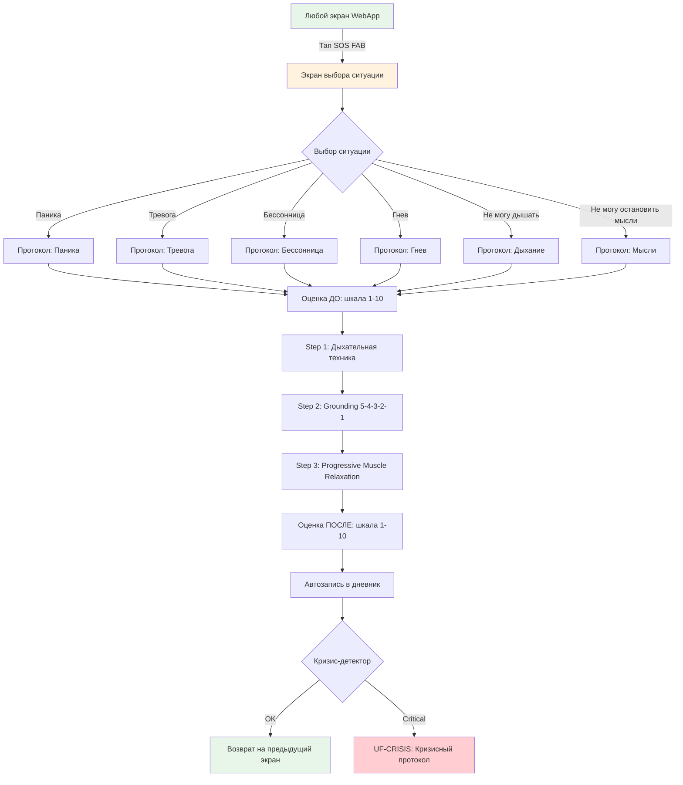

#### Happy Path (пошаговый)

| Шаг | Экран | Действие пользователя | Действие системы | Telegram WebApp |
|-----|-------|----------------------|------------------|-----------------|
| 1 | Любой экран | Тап на SOS-кнопку (FAB) | Haptic feedback (вибрация), открытие оверлея | HapticFeedback.impactOccurred('heavy') |
| 2 | Выбор ситуации | Тап на одну из 6 карточек ситуаций | Загрузка соответствующего протокола | BackButton.show() |
| 3 | Оценка ДО | Двигает слайдер 1-10 | Сохранение начальной оценки | MainButton: «Начать протокол» |
| 4 | Step 1: Дыхание | Следует визуальной анимации (вдох-задержка-выдох) | Анимация круга + TTS «Вдох... Задержите... Выдох...» + таймер | MainButton: «Следующий шаг» |
| 5 | Step 2: Grounding | Называет 5 предметов, 4 звука, 3 ощущения, 2 запаха, 1 вкус | Текстовые подсказки, поля для ввода (опционально) | MainButton: «Следующий шаг» |
| 6 | Step 3: PMR | Напрягает и расслабляет мышцы по группам | Визуальные подсказки + TTS + таймеры для каждой группы | MainButton: «Завершить» |
| 7 | Оценка ПОСЛЕ | Двигает слайдер 1-10 | Сохранение финальной оценки, расчёт дельты | MainButton: «Готово» |
| 8 | Результат | Просматривает результат (было X, стало Y) | Автозапись в дневник, предложение повторить или закрыть | MainButton: «Закрыть» |

#### Error Paths

**EP-SOS-1: Оффлайн-режим (нет интернета)**

| Шаг | Действие |
|-----|----------|
| 1 | Пользователь нажимает SOS без интернета |
| 2 | Система проверяет наличие кэшированных протоколов в CloudStorage |
| 3a | Кэш есть: загрузка базовых протоколов (дыхание, grounding) без TTS, только визуал и текст |
| 3b | Кэша нет: показ статического экрана с инструкцией дыхания 4-7-8 (зашита в код WebApp) |
| 4 | После восстановления связи — синхронизация данных (оценки до/после, запись в дневник) |

**EP-SOS-2: Переключение на кризисный протокол**

| Шаг | Действие |
|-----|----------|
| 1 | Во время SOS-протокола пользователь вводит текст с кризисными маркерами |
| 2 | Кризис-детектор определяет critical-уровень |
| 3 | Протокол мягко прерывается: «Я вижу, что вам сейчас очень тяжело» |
| 4 | Показывается non-dismissible overlay с горячей линией 8-800-2000-122 |
| 5 | Переход в UF-CRISIS flow |

#### Edge Cases

| Кейс | Обработка |
|------|-----------|
| Free-тариф | SOS доступен полностью (CON-005), тариф не проверяется |
| TTS недоступен | Протокол работает без голоса, только визуал и текст |
| Пользователь прервал на середине | Запись «SOS-протокол прерван» в дневник, предложение продолжить позже |
| Повторный SOS за 5 минут | Предложение: «Хотите продолжить предыдущий протокол или начать новый?» |
| Graceful degradation (лимит LLM) | SOS работает без LLM — протоколы статические, не требуют API |

#### Telegram WebApp Constraints

- SOS FAB реализуется как CSS-позиционированный элемент (position: fixed), не зависит от scroll.
- Кэширование протоколов через CloudStorage API (до 1 МБ, достаточно для текстовых протоколов).
- Дыхательная анимация — CSS-анимация (не требует сети).
- TTS — опциональный, загружается по сети; при отсутствии сети — только визуал.
- HapticFeedback используется при нажатии SOS и при переходе между шагами.

---

### UF-CRISIS: Кризис-детектор

**Связь с US:** US-017
**Связь с FR:** FR-006
**Приоритет:** P0 (Safety-Critical)
**Actors:** Любой пользователь (детектор работает автоматически)

#### Entry Points

| Источник | Действие | Контекст |
|----------|----------|----------|
| UF-CHAT (AI-чат) | Автоматический анализ каждого сообщения | Пользователь пишет в чат |
| UF-VOICE (Голос) | Анализ транскрибированного текста | Пользователь говорит |
| UF-SOS (SOS-протокол) | Анализ текстового ввода во время протокола | Пользователь в SOS-протоколе |
| UF-DIARY (Дневник) | Анализ текстовой заметки при записи эмоции | Пользователь пишет в дневник |

#### Exit Points

| Результат | Переход |
|-----------|---------|
| Low risk | Продолжение текущего flow без изменений |
| Moderate | Повышенная эмпатия ИИ, периодическое предложение специалиста |
| High | Мягкое предложение связаться со специалистом |
| Critical | Non-dismissible overlay с горячей линией |

#### Mermaid-диаграмма

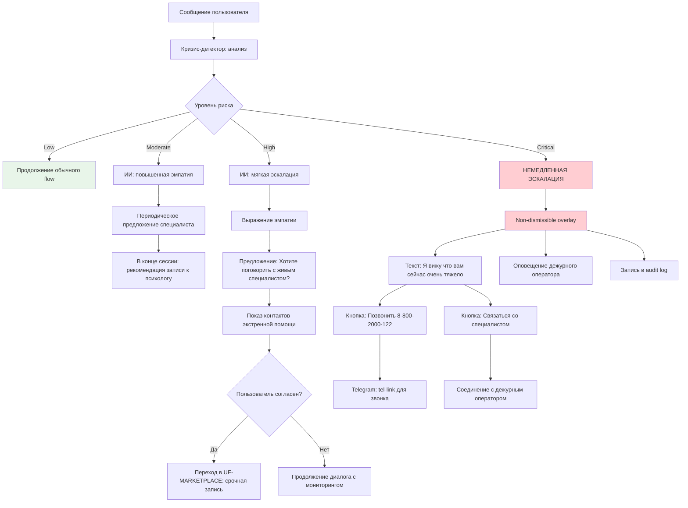

#### Happy Path (пошаговый) — Critical-уровень

| Шаг | Экран | Действие системы | Telegram WebApp |
|-----|-------|------------------|-----------------|
| 1 | Текущий экран (чат/дневник) | Детектор анализирует сообщение, определяет critical | Фоновый процесс |
| 2 | Non-dismissible overlay | Overlay поверх всего контента, нельзя закрыть | BackButton.hide(), overlay z-index max |
| 3 | Overlay: сообщение | «Я вижу, что вам сейчас очень тяжело. Вы не одиноки.» | HapticFeedback.notificationOccurred('warning') |
| 4 | Overlay: кнопка звонка | «Позвонить на горячую линию: 8-800-2000-122» | openLink('tel:88002000122') |
| 5 | Overlay: кнопка специалиста | «Связаться со специалистом прямо сейчас» | Переход к срочной записи или чат с оператором |
| 6 | Фон | Оповещение дежурного оператора через Telegram Bot | Bot API: sendMessage to operator group |
| 7 | Фон | Запись события в audit log | Серверный вызов |

#### Error Paths

**EP-CRISIS-1: False positive (ложное срабатывание)**

| Шаг | Действие |
|-----|----------|
| 1 | Детектор определяет high/critical уровень |
| 2 | Пользователь отвечает: «Всё нормально, я говорю в переносном смысле» |
| 3 | Система принимает ответ, но НЕ отключает детектор |
| 4 | Уровень понижается до moderate, мониторинг продолжается |
| 5 | Событие логируется как «declined_escalation» в audit log |
| 6 | Диалог продолжается в обычном режиме |

**EP-CRISIS-2: Ночное время (2:00-6:00)**

| Шаг | Действие |
|-----|----------|
| 1 | Детектор определяет critical в ночное время |
| 2 | Overlay показывается как обычно |
| 3 | Дополнительно: «Горячая линия работает 24/7» |
| 4 | Если дежурный оператор не на связи (SLA < 5 мин): автоматическое подключение SOS-протокола параллельно |
| 5 | Запись в инцидент-лог для утреннего разбора |

#### Edge Cases

| Кейс | Обработка |
|------|-----------|
| Детектор нельзя отключить (CON-004) | Настройки не содержат опции отключения, API отклоняет запросы |
| Отдельный бюджет LLM (CON-018) | При graceful degradation основного LLM детектор продолжает работать |
| Множественные срабатывания за сессию | Каждое логируется, overlay показывается один раз за сессию (при critical) |
| Пользователь закрыл WebApp при overlay | При повторном открытии overlay показывается снова (до взаимодействия) |
| Ночной режим | Overlay в тёмной теме, увеличенный шрифт |

#### Telegram WebApp Constraints

- Non-dismissible overlay: BackButton.hide(), перехват свайпов и жестов закрытия.
- Звонок на горячую линию: openLink('tel:88002000122') — переход в звонилку телефона.
- Оповещение оператора: через Telegram Bot API sendMessage в группу дежурных.
- Audit log: серверный API-вызов, не зависит от состояния клиента.

---

## 4. Онбординг

### UF-ONBOARD: Регистрация и онбординг

**Связь с US:** US-001, US-002, US-003, US-004
**Связь с FR:** FR-001
**Приоритет:** P0
**Actors:** Аня (P1), Олег (P4), Дмитрий (P2) — любой новый пользователь

#### Entry Points

| Источник | Действие | Контекст |
|----------|----------|----------|
| Telegram Bot | Команда /start или нажатие «Начать» | Первый визит |
| Deep link | Переход по ссылке t.me/bot?start=ref_XXX | Реферальная ссылка |
| B2B invite | Переход по корпоративной ссылке | Приглашение от HR |

#### Exit Points

| Результат | Переход |
|-----------|---------|
| Онбординг завершён | Главный экран с персонализированными рекомендациями |
| Отказ от disclaimer | WebApp закрывается, при следующем входе disclaimer повторяется |
| Выбран платный тариф | UF-PAYMENT (оплата через YooKassa) |

#### Mermaid-диаграмма

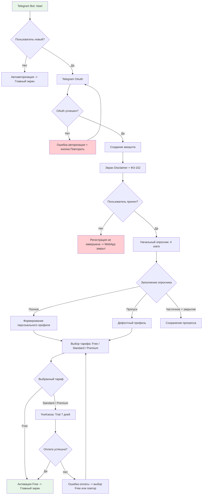

#### Happy Path (пошаговый)

| Шаг | Экран | Действие пользователя | Действие системы | Telegram WebApp |
|-----|-------|----------------------|------------------|-----------------|
| 1 | Telegram Bot | Нажимает «Начать» или /start | Бот отправляет приветствие + кнопку «Открыть приложение» | Bot API: WebApp button |
| 2 | Загрузка WebApp | Ожидает загрузку (< 3 сек) | Telegram OAuth: получение данных (имя, аватар, ID) | WebApp.initData |
| 3 | Disclaimer | Читает текст: «Это НЕ замена профессиональной помощи» | Показ чекбокса ФЗ-152, кнопка неактивна | MainButton: «Принимаю» (disabled) |
| 4 | Disclaimer | Отмечает чекбокс | Активация кнопки | MainButton: «Принимаю» (enabled) |
| 5 | Disclaimer | Тап MainButton | Сохранение согласия, переход к опроснику | MainButton.hide(), BackButton.show() |
| 6 | Опросник 1/4 | Двигает слайдер настроения (1-10) | Сохранение ответа | Progress: 25% |
| 7 | Опросник 2/4 | Выбирает проблемы (мультивыбор) | Сохранение ответов | Progress: 50% |
| 8 | Опросник 3/4 | Выбирает цели | Сохранение ответов | Progress: 75% |
| 9 | Опросник 4/4 | Выбирает триггеры | Сохранение ответов | Progress: 100% |
| 10 | Тарифы | Просматривает 3 плана, тапает на выбранный | Показ деталей плана | MainButton: «Начать бесплатно» / «Попробовать 7 дней» |
| 11 | Главный экран | Видит персонализированные рекомендации | Подсказки: «Попробуйте чат», «Заполните дневник» | Bottom nav + SOS FAB |

#### Error Paths

**EP-ONBOARD-1: Ошибка Telegram OAuth**

| Шаг | Действие |
|-----|----------|
| 1 | Telegram API недоступен или возвращает ошибку |
| 2 | Показ экрана: «Ошибка авторизации. Попробуйте позже.» |
| 3 | Кнопка «Повторить» — повторный запрос OAuth |
| 4 | Если 3 попытки неудачны: «Проверьте подключение к интернету и обновите Telegram» |

**EP-ONBOARD-2: Отказ от Disclaimer**

| Шаг | Действие |
|-----|----------|
| 1 | Пользователь нажимает BackButton или закрывает WebApp |
| 2 | Регистрация НЕ завершена (аккаунт в статусе pending) |
| 3 | При следующем открытии WebApp — показ Disclaimer снова |
| 4 | Данные согласия не зафиксированы — функционал заблокирован |

**EP-ONBOARD-3: Неполный опросник**

| Шаг | Действие |
|-----|----------|
| 1 | Пользователь заполнил 2 из 4 шагов и закрыл WebApp |
| 2 | Прогресс сохраняется в CloudStorage |
| 3 | При следующем входе: «Продолжить опросник?» (да / пропустить) |
| 4 | При пропуске — дефолтный профиль, кнопка «Заполнить опросник» в настройках |

#### Edge Cases

| Кейс | Обработка |
|------|-----------|
| Реферальная ссылка (deep link) | После OAuth — привязка реферера, Premium trial 7 дней вместо Standard |
| B2B invite link | После OAuth — привязка к корпоративной группе, тариф определяется B2B-контрактом |
| Повторный вход (уже зарегистрирован) | Автоматическая авторизация, переход на главный экран |
| Смена устройства | Аккаунт привязан к Telegram ID, данные синхронизируются |
| Верификация возраста (CON-011) | Чекбокс «Мне исполнилось 18 лет» на экране Disclaimer |
| Медленный интернет | Опросник загружает шаги по одному, минимальный размер страницы |
| Множество deep link параметров | Парсинг startapp-параметра: ref_XXX, b2b_XXX, promo_XXX |

#### Telegram WebApp Constraints

- Telegram OAuth: данные пользователя из WebApp.initData (Telegram ID, first_name, last_name, photo_url).
- Валидация initData: серверная проверка подписи (HMAC-SHA256) для предотвращения подделки.
- Disclaimer: полноэкранный экран, MainButton «Принимаю и продолжаю» (disabled пока чекбокс не отмечен).
- Чекбокс ФЗ-152: кастомный checkbox с ссылкой на полный текст политики (openLink).
- Опросник: 4 экрана-шага, горизонтальный progress bar сверху.
- Слайдер настроения: нативный range input, стилизованный с градиентом (зелёный-жёлтый-красный).
- Мультивыбор: chip-group (обёрнутые в flex-wrap), тап на чип = выбор/снятие выбора.
- Сохранение прогресса опросника: CloudStorage API при закрытии WebApp (window.onbeforeunload).
- Экран тарифов: 3 карточки с горизонтальным скроллом (swipeable), выделение рекомендуемого.
- Deep link: парсинг window.Telegram.WebApp.initDataUnsafe.start_param для определения контекста входа.
- BackButton: на Disclaimer — закрытие WebApp (window.Telegram.WebApp.close()), на опроснике — предыдущий шаг.

---

## 5. Основные функции (P0)

### UF-CHAT: AI-чат

**Связь с US:** US-005, US-006, US-007
**Связь с FR:** FR-002
**Приоритет:** P0
**Actors:** Аня (P1), Дмитрий (P2), Олег (P4)

#### Entry Points

| Источник | Действие |
|----------|----------|
| Главный экран | Тап на таб «Чат» |
| Push от бота | Deep link на чат после напоминания |
| UF-CBT | ИИ рекомендует обсудить результат упражнения |
| UF-DIARY | ИИ предлагает обсудить запись в дневнике |

#### Exit Points

| Результат | Переход |
|-----------|---------|
| Сессия завершена | Саммари -> оценка -> главный экран |
| Кризис-детектор (critical) | UF-CRISIS |
| Лимит Free | Предложение апгрейда -> UF-PAYMENT |
| Переключение на голос | UF-VOICE |

#### Mermaid-диаграмма

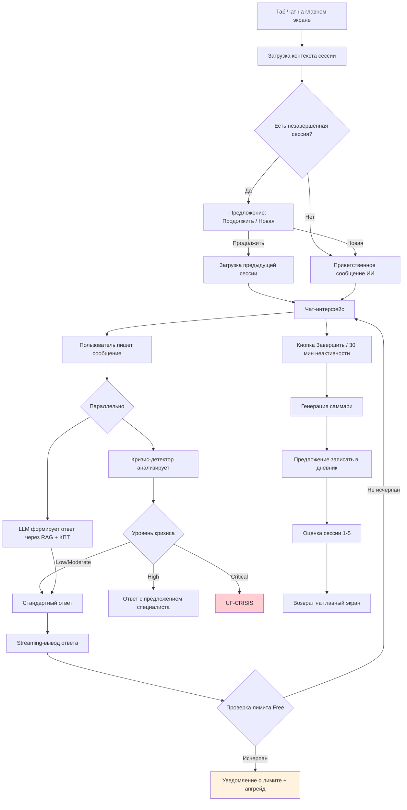

#### Happy Path (пошаговый)

| Шаг | Экран | Действие пользователя | Действие системы | Telegram WebApp |
|-----|-------|----------------------|------------------|-----------------|
| 1 | Главный экран | Тап на таб «Чат» | Загрузка контекста: профиль, история, дневник | BackButton.show() |
| 2 | Чат | Видит приветствие ИИ с учётом контекста | «Привет, Аня. Как вы себя чувствуете?» | Клавиатура открыта |
| 3 | Чат | Пишет сообщение | Отправка на сервер, индикатор «ИИ думает...» | MainButton скрыт |
| 4 | Чат | Читает ответ (streaming) | Посимвольный вывод, КПТ-техника, кризис-детектор | Scroll to bottom |
| 5 | Чат | Продолжает диалог (цикл шагов 3-4) | Каждое сообщение через детектор | — |
| 6 | Чат | Тап «Завершить сессию» | Генерация саммари: темы, мысли, рекомендации | MainButton: «Завершить» |
| 7 | Саммари | Просматривает саммари | Предложение записать в дневник | — |
| 8 | Оценка | Ставит оценку 1-5 | Сохранение, обновление профиля | MainButton: «Готово» |

#### Error Paths

**EP-CHAT-1: Лимит сессий Free**

| Шаг | Действие |
|-----|----------|
| 1 | Пользователь на Free отправил 5-е сообщение |
| 2 | Сообщение «Лимит на сегодня исчерпан (5/5)» |
| 3 | Показ времени до сброса: «Обновится через X часов» |
| 4 | Кнопка «Перейти на Standard — без ограничений» |
| 5 | Дневник, упражнения, медитации остаются доступными |

**EP-CHAT-2: Потеря соединения**

| Шаг | Действие |
|-----|----------|
| 1 | Соединение прервалось во время streaming-ответа |
| 2 | Показ «Соединение потеряно. Подключаемся...» |
| 3 | Автоматический retry каждые 5 секунд (до 3 раз) |
| 4 | Если не восстановлено: «Проверьте подключение» + кнопка «Повторить» |
| 5 | Последнее сообщение пользователя сохранено, при восстановлении — дозагрузка ответа |

#### Edge Cases

| Кейс | Обработка |
|------|-----------|
| Вопрос вне компетенции ИИ | «Этот вопрос выходит за мои возможности. Рекомендую специалиста» + ссылка на маркетплейс |
| Кризис-детектор: moderate | Повышенная эмпатия, периодическое «Хотите записаться к специалисту?» |
| Graceful degradation (LLM лимит) | «Сервис временно работает в ограниченном режиме» + предложение дневника/упражнения |
| 30 мин неактивности | Автозавершение сессии, генерация саммари |
| Продолжение предыдущей сессии | «Продолжить» загружает историю последней сессии, ИИ учитывает контекст |
| Рекомендация упражнения в чате | Интерактивная карточка: название упражнения + кнопка «Попробовать» -> переход в UF-CBT |
| Саммари сессии (P1) | Генерируется при завершении: ключевые темы, мысли, рекомендации |

#### Telegram WebApp Constraints

- Чат-интерфейс: кастомный (не нативный Telegram-чат), вертикальный scroll, bubbles слева (ИИ) и справа (пользователь).
- Streaming output: WebSocket или SSE для посимвольного вывода ответа ИИ, auto-scroll вниз.
- Текстовый input: нативный Telegram-input через textarea, auto-resize по высоте текста.
- MainButton: скрыт во время диалога, показывается как «Завершить сессию» при свайпе вверх или тапе на header.
- BackButton: возврат на главный экран (с подтверждением: «Завершить сессию?»).
- Клавиатура: при открытии чата клавиатура открывается автоматически, фокус на input.
- История сессий: доступна через кнопку «История» в header чата, lazy loading.
- Индикатор «ИИ думает»: анимированные три точки в bubble ИИ (аналог Telegram typing indicator).
- Disclaimer: мини-баннер под header чата, compact-режим (одна строка).
- Кризис-детектор: overlay поверх чата при critical, чат виден под overlay.

---

### UF-VOICE: Голосовые сессии

**Связь с US:** US-008, US-009
**Связь с FR:** FR-003
**Приоритет:** P0
**Actors:** Дмитрий (P2)

#### Entry Points

| Источник | Действие |
|----------|----------|
| UF-CHAT | Тап на кнопку «Голос» в чате |
| Главный экран | Таб «Чат» -> кнопка «Голосовая сессия» |

#### Exit Points

| Результат | Переход |
|-----------|---------|
| Сессия завершена | Транскрипция + саммари |
| Переключение на текст | UF-CHAT (контекст сохраняется) |
| Лимит Standard | Предложение Premium |
| Free-тариф | Сообщение о недоступности |

#### Mermaid-диаграмма

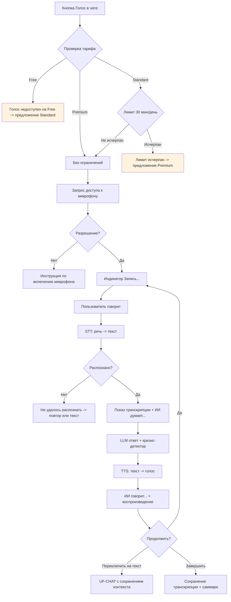

#### Happy Path (пошаговый)

| Шаг | Экран | Действие пользователя | Действие системы | Telegram WebApp |
|-----|-------|----------------------|------------------|-----------------|
| 1 | Чат | Тап на кнопку «Голос» | Проверка тарифа и лимитов | — |
| 2 | Голос | — | Запрос доступа к микрофону | MediaDevices.getUserMedia() |
| 3 | Голос | Говорит | Индикатор «Запись...», запись аудио | — |
| 4 | Голос | Пауза / отпускает кнопку | STT обработка (< 3 сек) | Показ транскрипции |
| 5 | Голос | Читает транскрипцию | Параллельно: кризис-детектор + LLM | «ИИ думает...» |
| 6 | Голос | Слушает ответ | TTS озвучка (< 2 сек задержка) | «ИИ говорит...» |
| 7 | Голос | Продолжает (цикл 3-6) | Учёт времени для лимитов Standard | Таймер сессии |
| 8 | Голос | Тап «Завершить» | Сохранение транскрипции, саммари | MainButton: «Завершить» |

#### Error Paths

**EP-VOICE-1: Шумное окружение**

| Шаг | Действие |
|-----|----------|
| 1 | STT не распознаёт речь 2 раза подряд |
| 2 | «Не удалось распознать речь. Шумно?» |
| 3 | Предложение: «Переключиться на текст» или «Попробовать снова» |
| 4 | При переключении на текст — контекст сессии сохраняется |

**EP-VOICE-2: Нет микрофона**

| Шаг | Действие |
|-----|----------|
| 1 | Браузер отклоняет запрос микрофона |
| 2 | «Для голосовой сессии нужен доступ к микрофону» |
| 3 | Инструкция: «Разрешите доступ в настройках Telegram» |
| 4 | Кнопка «Продолжить текстом» |

#### Edge Cases

| Кейс | Обработка |
|------|-----------|
| Лимит Standard исчерпан во время сессии | Предупреждение за 2 мин до лимита, плавное завершение |
| STT engine перегружен | «Голосовой сервис временно недоступен. Переключиться на текст?» |
| Переключение текст-голос и обратно | Контекст беседы полностью сохраняется |
| Free-тариф нажимает «Голос» | «Голосовые сессии доступны на Standard (990 руб/мес) и Premium (2990 руб/мес)» + кнопка апгрейда |
| Кризис-детектор на транскрипции | Анализирует транскрибированный текст точно так же, как обычное сообщение в чате |

#### Telegram WebApp Constraints

- Микрофон: запрос через navigator.mediaDevices.getUserMedia({audio: true}) — требует HTTPS.
- Индикатор записи: анимированная waveform (визуализация амплитуды), красная точка «REC».
- Кнопка записи: push-to-talk (удерживать) или toggle (нажать для начала/окончания записи) — настраивается.
- STT: аудио отправляется на self-hosted сервер через WebSocket для минимальной задержки.
- TTS: streaming audio через Web Audio API, индикатор «ИИ говорит...» с визуализацией.
- Транскрипция: текст транскрипции отображается в bubble пользователя (как обычное сообщение).
- Переключатель текст/голос: toggle-кнопка в input-area чата (иконка микрофона / клавиатуры).
- Лимит Standard: таймер в header «Осталось: XX мин», предупреждение за 2 мин (HapticFeedback + overlay).
- BackButton: при нажатии — подтверждение «Завершить голосовую сессию?» + сохранение транскрипции.

---

### UF-DIARY: Дневник эмоций

**Связь с US:** US-010, US-011, US-012, US-013
**Связь с FR:** FR-004
**Приоритет:** P0
**Actors:** Олег (P4), Аня (P1)

#### Entry Points

| Источник | Действие |
|----------|----------|
| Главный экран | Таб «Дневник» |
| Push-напоминание | Deep link из Telegram Bot |
| UF-CHAT | Предложение записать после сессии |
| UF-SOS | Автозапись после SOS-протокола |

#### Exit Points

| Результат | Переход |
|-----------|---------|
| Запись сохранена | Timeline дневника |
| Просмотр аналитики | Графики и инсайты |
| Лимит Free | Предложение апгрейда |

#### Mermaid-диаграмма

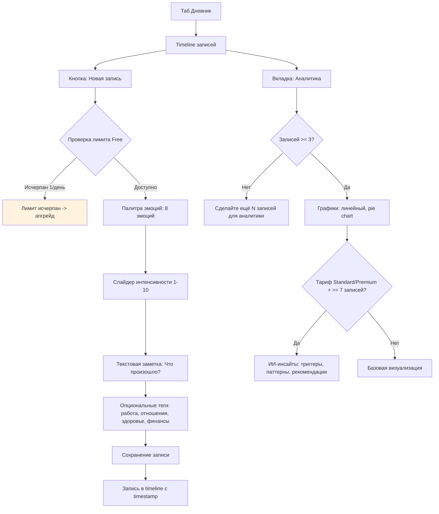

#### Happy Path (пошаговый)

| Шаг | Экран | Действие пользователя | Действие системы | Telegram WebApp |
|-----|-------|----------------------|------------------|-----------------|
| 1 | Главный экран | Тап на таб «Дневник» | Загрузка timeline записей | BackButton.show() |
| 2 | Timeline | Тап «Новая запись» (+) | Проверка лимита Free | — |
| 3 | Палитра | Тап на эмоцию (радость/грусть/тревога/...) | Подсветка выбранной | HapticFeedback |
| 4 | Интенсивность | Двигает слайдер 1-10 | Визуальный фидбек (цвет) | — |
| 5 | Заметка | Пишет «Что произошло?» | — | Клавиатура |
| 6 | Теги | Выбирает теги (опционально) | — | Чипы мультивыбора |
| 7 | — | Тап MainButton «Сохранить» | Сохранение, обновление timeline | MainButton: «Сохранить» |
| 8 | Timeline | Видит новую запись сверху | Анимация добавления | — |

#### Error Paths

**EP-DIARY-1: Пустая запись**

| Шаг | Действие |
|-----|----------|
| 1 | Пользователь не выбрал эмоцию и нажал «Сохранить» |
| 2 | MainButton неактивен пока не выбрана хотя бы эмоция |
| 3 | Подсказка: «Выберите эмоцию для сохранения записи» |

**EP-DIARY-2: Первая запись**

| Шаг | Действие |
|-----|----------|
| 1 | Пользователь открывает дневник впервые |
| 2 | Вместо timeline — onboarding-карточка |
| 3 | «Начните вести дневник эмоций. Это поможет понять ваши паттерны» |
| 4 | Кнопка «Создать первую запись» |

#### Edge Cases

| Кейс | Обработка |
|------|-----------|
| Free: 1 запись/день | «Лимит записей исчерпан. Standard = неограниченные записи» |
| Автозапись из SOS | Запись создаётся автоматически: эмоция = та, что при SOS; оценки до/после |
| Аналитика: < 3 записей | «Сделайте ещё N записей для графиков» |
| ИИ-инсайты: < 7 записей за 7 дней | «Продолжайте вести дневник, инсайты появятся через N записей» |
| Push-напоминание: запись уже сделана | Push НЕ отправляется, если запись за сегодня уже есть |
| Push-напоминание: нажатие на push | Deep link: открытие WebApp с формой новой записи (UF-DIARY, шаг 3) |

#### Telegram WebApp Constraints

- Палитра эмоций: горизонтальный скролл из 8 эмодзи-карточек с текстом, каждая >= 44x44dp.
- Слайдер интенсивности: нативный range input, стилизованный под цветовую шкалу (зелёный-жёлтый-красный).
- Графики аналитики: Canvas-based (Chart.js или аналог, лёгкий для мобильного Telegram WebApp).
- Push-напоминания: Telegram Bot API sendMessage с InlineKeyboard «Записать эмоцию» (deep link на WebApp).
- Данные дневника при оффлайн: сохраняются в CloudStorage, синхронизируются при восстановлении сети.
- BackButton: на всех экранах дневника, кроме timeline (он является корневым экраном таба).

---

### UF-CBT: КПТ-упражнения

**Связь с US:** US-014, US-015, US-016
**Связь с FR:** FR-005
**Приоритет:** P0
**Actors:** Дмитрий (P2), Аня (P1)

#### Entry Points

| Источник | Действие |
|----------|----------|
| Главный экран | Таб «Практики» -> «КПТ-упражнения» |
| UF-CHAT | ИИ рекомендует упражнение в контексте чата |
| Push-напоминание | Напоминание о назначенном упражнении |

#### Exit Points

| Результат | Переход |
|-----------|---------|
| Упражнение завершено | Сводка + предложение сохранить в дневник |
| Прерывание | Сохранение прогресса, возврат в каталог |
| Лимит Free | Предложение апгрейда |

#### Mermaid-диаграмма

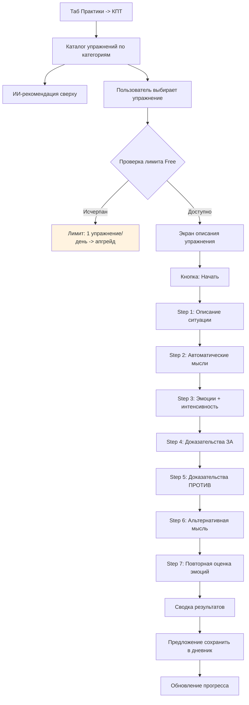

#### Happy Path (пошаговый)

| Шаг | Экран | Действие пользователя | Действие системы | Telegram WebApp |
|-----|-------|----------------------|------------------|-----------------|
| 1 | Каталог | Просматривает категории, видит ИИ-рекомендацию | Загрузка каталога с персонализацией | BackButton.show() |
| 2 | Каталог | Тап на упражнение | Показ описания, длительности, сложности | — |
| 3 | Описание | Тап «Начать» | Проверка лимита, инициализация | MainButton: «Начать» |
| 4-10 | Steps 1-7 | Заполняет каждый шаг | Прогресс-бар, подсказки | MainButton: «Далее» |
| 11 | Сводка | Просматривает результат | Визуализация было/стало | MainButton: «Готово» |
| 12 | Дневник | Подтверждает сохранение | Запись в дневник + обновление прогресса | — |

#### Error Paths

**EP-CBT-1: Прерывание упражнения**

| Шаг | Действие |
|-----|----------|
| 1 | Пользователь закрыл WebApp на Step 4 |
| 2 | Прогресс сохранён (шаги 1-3 заполнены) |
| 3 | При следующем входе: «Продолжить упражнение с шага 4?» |
| 4 | Да — продолжение; Нет — удаление прогресса |

**EP-CBT-2: Завершение курса упражнений**

| Шаг | Действие |
|-----|----------|
| 1 | Пользователь завершил все упражнения в категории |
| 2 | «Вы прошли все упражнения категории!» + достижение |
| 3 | Рекомендация следующей категории |

#### Edge Cases

| Кейс | Обработка |
|------|-----------|
| Free: 1 упражнение/день | «Лимит на сегодня. Доступно Standard для неограниченного доступа» |
| ИИ-рекомендация упражнения из чата | Предзаполненный контекст (ситуация из чата) в Step 1 |
| Прерывание на Step 7 (последний) | Результат считается завершённым, повторная оценка = предыдущая оценка |
| Персональная программа (Standard/Premium) | Цепочка из 5-7 упражнений с ежедневными напоминаниями |

#### Telegram WebApp Constraints

- Пошаговый интерфейс: wizard-pattern с горизонтальным прогресс-баром (7 шагов).
- Каждый шаг: текстовое поле + подсказка; MainButton: «Далее» или «Завершить» (на последнем шаге).
- BackButton: возврат на предыдущий шаг (не выход из упражнения).
- Прогресс: сохраняется в CloudStorage при закрытии WebApp.
- Каталог: вертикальный список карточек с иконками категорий, ИИ-рекомендация в отдельном блоке сверху.
- Подсказки в упражнениях: tooltip при тапе на иконку (?) рядом с полем ввода.

---

### UF-MARKETPLACE: Маркетплейс психологов

**Связь с US:** US-018, US-019, US-020, US-021
**Связь с FR:** FR-007
**Приоритет:** P0
**Actors:** Олег (P4), Елена (P5 — психолог)

#### Entry Points

| Источник | Действие |
|----------|----------|
| Главный экран | «Найти психолога» |
| UF-CHAT | ИИ предлагает записаться к специалисту |
| UF-CRISIS | Кнопка «Связаться со специалистом» |

#### Exit Points

| Результат | Переход |
|-----------|---------|
| Запись создана | Подтверждение + push-напоминание |
| Оплата | UF-PAYMENT (YooKassa) |
| Отмена записи | Возврат средств (если > 24ч) |

#### Mermaid-диаграмма

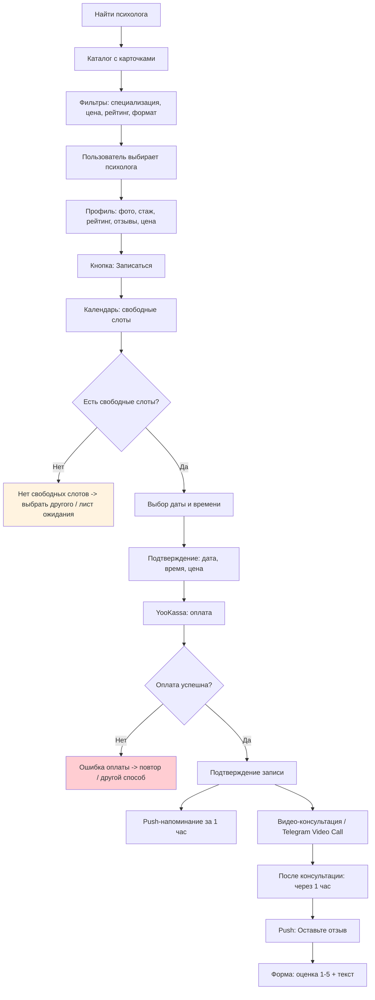

#### Happy Path (пошаговый)

| Шаг | Экран | Действие пользователя | Действие системы | Telegram WebApp |
|-----|-------|----------------------|------------------|-----------------|
| 1 | Каталог | Просматривает карточки, применяет фильтры | Загрузка каталога, ИИ-рекомендация | BackButton.show() |
| 2 | Профиль | Тап на карточку психолога | Загрузка профиля, отзывов | — |
| 3 | Профиль | Тап «Записаться» | Загрузка календаря | MainButton: «Записаться» |
| 4 | Календарь | Выбирает дату и время | Бронирование слота (5 мин hold) | MainButton: «Подтвердить» |
| 5 | Подтверждение | Просматривает детали | Показ суммы с учётом скидки тарифа | MainButton: «Оплатить X руб» |
| 6 | YooKassa | Оплата картой/ЮMoney/SBP | Обработка платежа | openLink(YooKassa URL) |
| 7 | Подтверждение | Видит «Запись подтверждена» | Push-напоминание за 1 час до | — |

#### Error Paths

**EP-MARKET-1: Нет свободных слотов**

| Шаг | Действие |
|-----|----------|
| 1 | У выбранного психолога нет слотов в ближайшие 7 дней |
| 2 | «Нет свободных слотов на ближайшую неделю» |
| 3 | Предложение: «Встать в лист ожидания» или «Выбрать другого специалиста» |
| 4 | При появлении слота — push-уведомление |

**EP-MARKET-2: Отмена записи**

| Шаг | Действие |
|-----|----------|
| 1 | Пользователь нажимает «Отменить запись» |
| 2 | Проверка: до консультации > 24 часа? |
| 3a | Да: отмена + возврат средств на карту |
| 3b | Нет: «Отмена менее чем за 24 часа невозможна. Свяжитесь с поддержкой» |

#### Edge Cases

| Кейс | Обработка |
|------|-----------|
| Срочная запись из UF-CRISIS | Фильтр «Ближайший доступный», пометка «срочно» для психолога |
| Скидка по тарифу | Standard: -5%, Premium: -10% от цены |
| Комиссия 15% (CON-017) | Психолог видит выплату за вычетом комиссии |
| Модерация отзывов | Автоматическая + ручная при жалобах |
| Отзыв: через 1 час после консультации | Push через Bot с кнопкой «Оставить отзыв» |
| Психолог: панель управления расписанием | Еженедельный календарь, доступные/забронированные слоты, блокировка времени |
| Психолог: статистика | Кол-во консультаций, средний рейтинг, доход (минус комиссия), отзывы |

#### Telegram WebApp Constraints

- Каталог: вертикальный список карточек психологов, lazy loading при скролле.
- Фильтры: выдвижной bottom-sheet при тапе на «Фильтры» (специализация, цена, рейтинг, формат).
- Календарь: кастомный date-picker (не нативный, для единообразия UX).
- Оплата: openLink(YooKassa URL) — перенаправление в браузер для оплаты, возврат в WebApp по callback.
- Push-напоминание за 1 час: через Telegram Bot API с кнопкой «Открыть» (deep link на детали записи).
- Видео-консультация: openLink(video URL) или Telegram Video Call (через Bot API).
- Отзывы: форма в WebApp — рейтинг 1-5 (звёзды) + текстовое поле (опционально).
- Панель психолога: отдельный режим WebApp (определяется по роли пользователя).

---

### UF-MEDITATION: Медитации и дыхание

**Связь с US:** US-022, US-023, US-024
**Связь с FR:** FR-008
**Приоритет:** P0
**Actors:** Аня (P1)

#### Entry Points

| Источник | Действие |
|----------|----------|
| Главный экран | Таб «Практики» -> «Медитации» |
| UF-SOS | Протокол содержит дыхательную практику |
| UF-WEARABLES | Стресс-алерт -> предложение медитации |

#### Exit Points

| Результат | Переход |
|-----------|---------|
| Медитация завершена | Оценка -> возврат в каталог |
| Прерывание | Возврат в каталог |
| Лимит Free | Предложение Premium |

#### Mermaid-диаграмма

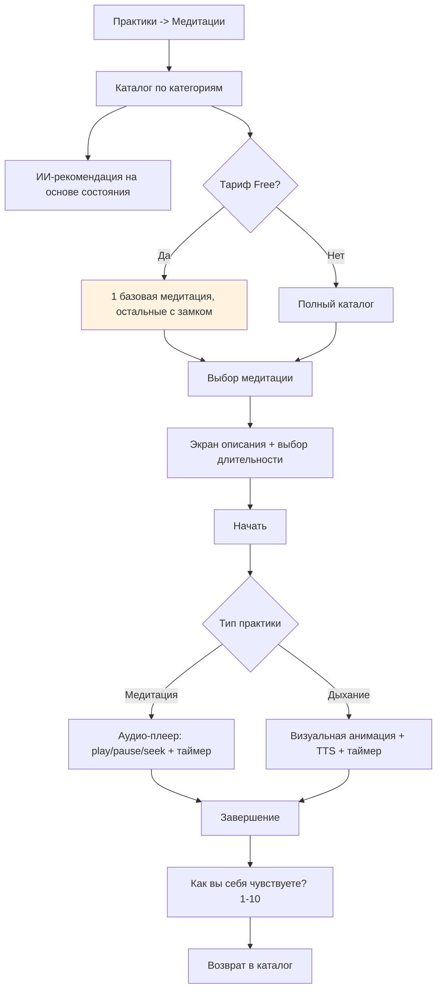

#### Happy Path (пошаговый)

| Шаг | Экран | Действие пользователя | Действие системы | Telegram WebApp |
|-----|-------|----------------------|------------------|-----------------|
| 1 | Каталог | Просматривает категории (Расслабление, Сон, Тревога...) | ИИ-рекомендация сверху | BackButton.show() |
| 2 | Каталог | Тап на медитацию | Показ описания | — |
| 3 | Описание | Выбирает длительность (3/5/10/15/20 мин) | — | MainButton: «Начать» |
| 4 | Плеер | Слушает (медитация) или следует анимации (дыхание) | Воспроизведение аудио (TTS) или CSS-анимация | — |
| 5 | Плеер | Play/pause/stop при необходимости | Пауза/продолжение | — |
| 6 | Завершение | Оценка состояния 1-10 | Сохранение прогресса, обновление серии | MainButton: «Готово» |

#### Error Paths

**EP-MED-1: Прерывание медитации**

| Шаг | Действие |
|-----|----------|
| 1 | Пользователь закрыл WebApp во время медитации |
| 2 | Прогресс сохранён как «прерванная» |
| 3 | При следующем входе: «Продолжить медитацию?» |

**EP-MED-2: Оффлайн-режим**

| Шаг | Действие |
|-----|----------|
| 1 | Пользователь пытается запустить медитацию без интернета |
| 2 | Дыхательные практики работают (CSS-анимация, без TTS) |
| 3 | Аудио-медитации недоступны: «Нет подключения. Попробуйте дыхательную практику» |

#### Edge Cases

| Кейс | Обработка |
|------|-----------|
| Free: 1 медитация | Остальные с иконкой замка, тап -> предложение Premium |
| Premium: фоновые звуки | Селектор: природа, дождь, океан, white noise |
| Дыхание в контексте SOS | Автоматический выбор дыхательной практики (4-7-8 для паники, квадратное для тревоги) |
| Выбор длительности | Dropdown или чипы: 3 / 5 / 10 / 15 / 20 мин |
| Прерывание медитации (звонок) | При возврате: «Продолжить с места остановки?» |

#### Telegram WebApp Constraints

- Аудио-плеер: кастомный HTML5 Audio с UI (play/pause, seek bar, таймер), не нативный Telegram-плеер.
- Дыхательная анимация: CSS keyframes для расширения/сужения круга, не зависит от сети.
- TTS для медитаций: streaming audio через Web Audio API; при отсутствии сети — только визуальный режим.
- Фоновые звуки (Premium): отдельный Audio-поток, микшируемый с TTS через Web Audio API.
- Полноэкранный режим: скрытие bottom-nav и SOS FAB во время медитации (SOS доступен через BackButton).
- BackButton: пауза медитации + подтверждение «Остановить медитацию?» (предотвращение случайного выхода).
- Выбор длительности: chip-group (горизонтальные чипы), один выбранный, по умолчанию 5 мин.
- Оценка после медитации: появляется после завершения, перед возвратом в каталог.

---

### UF-WEARABLES: Носимые устройства

**Связь с US:** US-025, US-026, US-027
**Связь с FR:** FR-009
**Приоритет:** P0
**Actors:** Дмитрий (P2), Олег (P4 — Mi Band)

#### Entry Points

| Источник | Действие |
|----------|----------|
| Профиль | Настройки -> Устройства |

#### Exit Points

| Результат | Переход |
|-----------|---------|
| Устройство подключено | Синхронизация каждые 15 мин |
| Стресс-алерт | Push -> deep link на дыхательную практику |

#### Mermaid-диаграмма

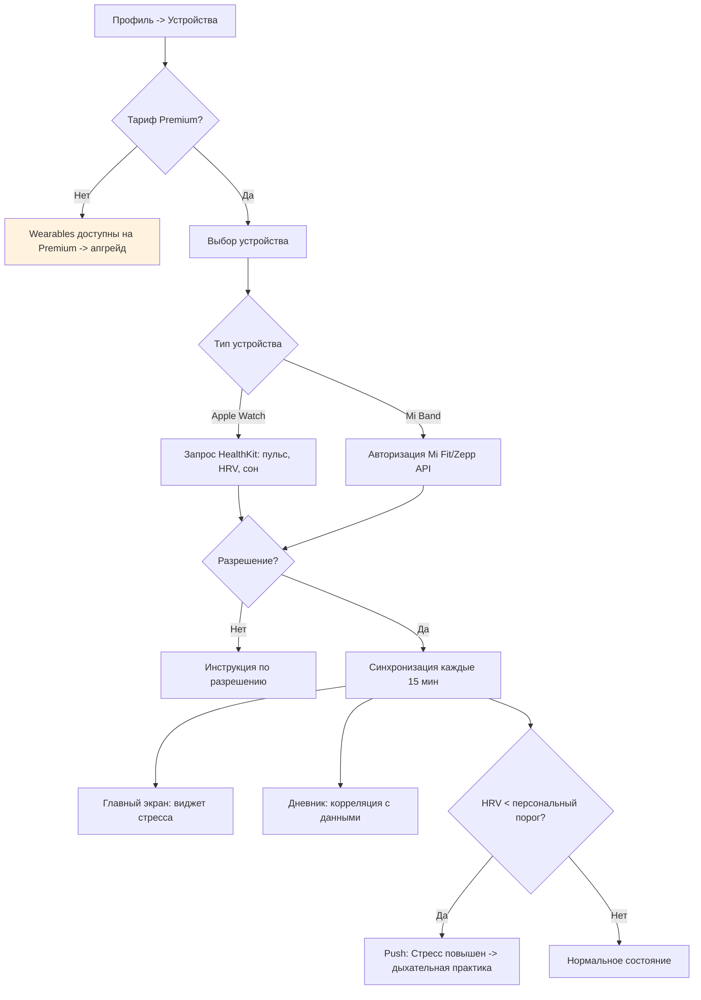

#### Happy Path (пошаговый)

| Шаг | Экран | Действие пользователя | Действие системы | Telegram WebApp |
|-----|-------|----------------------|------------------|-----------------|
| 1 | Устройства | Тап «Подключить Apple Watch / Mi Band» | Проверка тарифа | — |
| 2 | Авторизация | Подтверждает доступ | Запрос HealthKit / Mi Fit API | openLink (авторизация) |
| 3 | — | — | Синхронизация HR, HRV, сон каждые 15 мин | Фоновый процесс |
| 4 | Главный экран | Видит виджет текущего стресса | Визуализация на основе HRV | — |
| 5 | Telegram | Получает push при высоком стрессе | «Стресс повышен. Попробуйте дыхательную практику» | Bot push + deep link |

#### Error Paths

**EP-WEAR-1: Устройство недоступно**

| Шаг | Действие |
|-----|----------|
| 1 | Нет Bluetooth-соединения или устройство разряжено |
| 2 | «Устройство не найдено. Проверьте подключение» |
| 3 | Данные стресса показываются за последний успешный период |

**EP-WEAR-2: Потеря связи с API**

| Шаг | Действие |
|-----|----------|
| 1 | Mi Fit / HealthKit API недоступен |
| 2 | Последние данные показываются с пометкой «обновлено X минут назад» |
| 3 | Автоматический retry каждые 15 минут |

---

### UF-PAYMENT: Подписки и платежи

**Связь с US:** US-028, US-029
**Связь с FR:** FR-010
**Приоритет:** P0
**Actors:** Дмитрий (P2), Аня (P1)

#### Entry Points

| Источник | Действие |
|----------|----------|
| UF-ONBOARD | Выбор тарифа при регистрации |
| Профиль | Управление подпиской |
| Любой paywall | «Перейти на Standard/Premium» |

#### Exit Points

| Результат | Переход |
|-----------|---------|
| Подписка активирована | Возврат к предыдущему экрану с новым тарифом |
| Ошибка оплаты | Повтор или выбор Free |
| Отмена подписки | Подписка действует до конца периода |

#### Mermaid-диаграмма

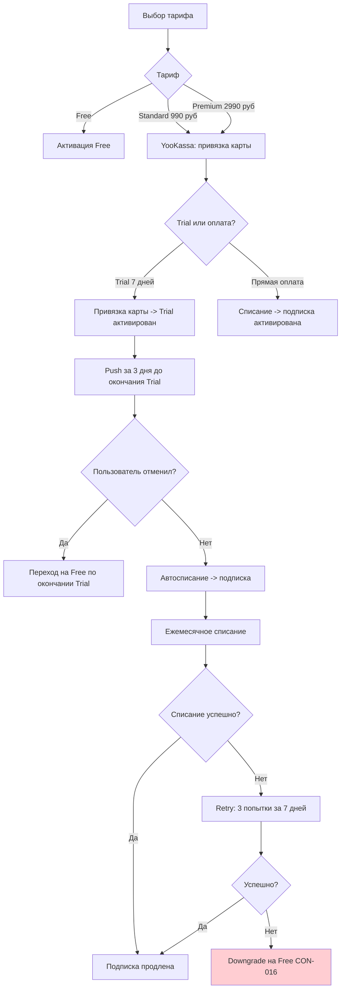

#### Happy Path (пошаговый)

| Шаг | Экран | Действие пользователя | Действие системы | Telegram WebApp |
|-----|-------|----------------------|------------------|-----------------|
| 1 | Тарифы | Выбирает Standard/Premium | Показ деталей: цена, trial, функции | MainButton: «Попробовать 7 дней» |
| 2 | YooKassa | Вводит данные карты | Привязка карты, создание trial | openLink(YooKassa URL) |
| 3 | Подтверждение | Видит «Подписка активирована!» | Push через Bot + обновление тарифа | — |
| 4 | — | — | Push за 3 дня до списания | Bot API |
| 5 | Профиль | Управляет подпиской при необходимости | Отмена/смена плана | — |

#### Error Paths

**EP-PAY-1: Ошибка оплаты**

| Шаг | Действие |
|-----|----------|
| 1 | YooKassa возвращает ошибку (недостаточно средств, ошибка банка) |
| 2 | «Оплата не прошла. Попробуйте другой способ» |
| 3 | Предложение: другая карта, ЮMoney, SBP |
| 4 | Пользователь остаётся на текущем тарифе |

**EP-PAY-2: Отмена подписки**

| Шаг | Действие |
|-----|----------|
| 1 | Пользователь нажимает «Отменить подписку» |
| 2 | «Подписка будет действовать до [дата]. После вы перейдёте на Free» |
| 3 | Двойное подтверждение |
| 4 | Подписка отменяется с конца текущего периода |

---

### UF-B2B: Корпоративное управление

**Связь с US:** US-030, US-031
**Связь с FR:** FR-011
**Приоритет:** P0
**Actors:** Марина (P3 — HR)

#### Entry Points

| Источник | Действие |
|----------|----------|
| Главный экран HR | Раздел «B2B» |

#### Exit Points

| Результат | Переход |
|-----------|---------|
| Группа создана | Ссылка-приглашение |
| Аналитика | Агрегированные данные |

#### Mermaid-диаграмма

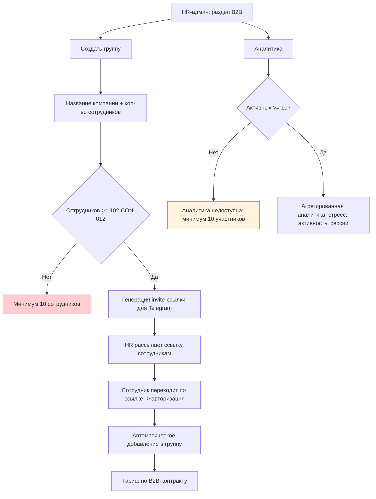

#### Happy Path (пошаговый)

| Шаг | Экран | Действие HR | Действие системы |
|-----|-------|-------------|------------------|
| 1 | B2B | Тап «Создать группу» | Форма: название, кол-во |
| 2 | Форма | Заполняет данные | Проверка >= 10 (CON-012) |
| 3 | Ссылка | Копирует invite-ссылку | Генерация уникальной ссылки |
| 4 | — | Рассылает сотрудникам | Сотрудники получают Premium-доступ |
| 5 | Аналитика | Просматривает дашборд | Агрегированные данные (анонимные, CON-014) |

#### Error Paths

**EP-B2B-1: Сотрудник увольняется**

| Шаг | Действие |
|-----|----------|
| 1 | HR удаляет сотрудника из группы |
| 2 | Сотрудник переводится на Free-тариф |
| 3 | Персональные данные остаются у сотрудника |
| 4 | Данные исключаются из B2B-аналитики |

**EP-B2B-2: Меньше 10 активных**

| Шаг | Действие |
|-----|----------|
| 1 | Количество активных участников упало ниже 10 |
| 2 | Аналитика скрывается: «Минимум 10 активных участников» |
| 3 | Уведомление HR о необходимости привлечения участников |

---

### UF-PROFILE: Профиль и настройки

**Связь с US:** US-032, US-033, US-034
**Связь с FR:** FR-012
**Приоритет:** P0
**Actors:** Олег (P4), Аня (P1)

#### Entry Points

| Источник | Действие |
|----------|----------|
| Главный экран | Таб «Профиль» |

#### Exit Points

| Результат | Переход |
|-----------|---------|
| Настройки изменены | Возврат в профиль |
| Удаление аккаунта | Подтверждение -> выход |
| Экспорт данных | ZIP в Telegram-чат (через 24ч) |

#### Mermaid-диаграмма

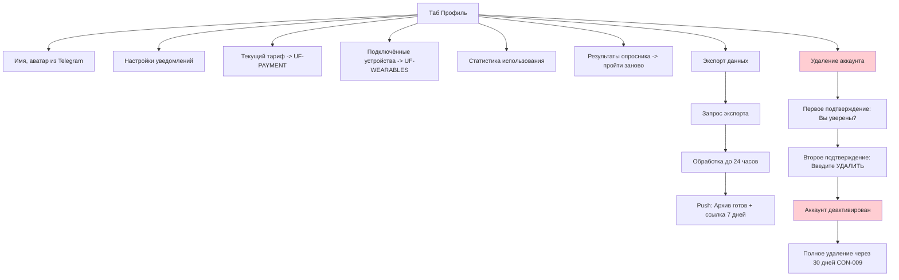

#### Happy Path — Удаление аккаунта

| Шаг | Экран | Действие пользователя | Действие системы |
|-----|-------|----------------------|------------------|
| 1 | Профиль | Тап «Удалить аккаунт» | Показ предупреждения |
| 2 | Подтверждение 1 | Тап «Да, удалить» | Второй экран подтверждения |
| 3 | Подтверждение 2 | Вводит слово «УДАЛИТЬ» | Деактивация аккаунта, отмена подписки |
| 4 | Прощание | Видит «Аккаунт будет удалён через 30 дней» | Push-подтверждение, schedule полного удаления |

#### Error Paths

**EP-PROFILE-1: Экспорт данных — большой объём**

| Шаг | Действие |
|-----|----------|
| 1 | Пользователь запрашивает экспорт |
| 2 | «Экспорт может занять до 24 часов. Мы уведомим вас в Telegram» |
| 3 | ZIP-архив отправляется через Bot в чат |
| 4 | Ссылка действует 7 дней |

---

### UF-LIMITS: Система лимитов

**Связь с US:** US-035, US-036, US-037
**Связь с FR:** FR-013
**Приоритет:** P0
**Actors:** Сергей (P6 — админ), Аня (P1 — при graceful degradation)

#### Entry Points

| Источник | Действие |
|----------|----------|
| Админ-панель | Раздел «Лимиты» |
| Telegram Bot (админ) | Алерт о приближении к лимиту |

#### Exit Points

| Результат | Переход |
|-----------|---------|
| Лимиты настроены | Применение в реальном времени |
| Graceful degradation | Ограниченный режим для пользователей |

#### Mermaid-диаграмма

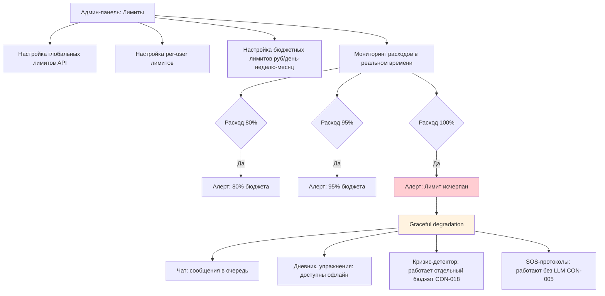

#### Happy Path (пошаговый)

| Шаг | Экран | Действие админа | Действие системы |
|-----|-------|-----------------|------------------|
| 1 | Лимиты | Устанавливает бюджет: 100 000 руб/мес | Сохранение, применение |
| 2 | Мониторинг | Просматривает текущий расход | Обновление в реальном времени |
| 3 | Telegram | Получает алерт при 80% | Push: «Расход 80%: 80 000 руб из 100 000» |
| 4 | Лимиты | Увеличивает лимит (если нужно) | Применение нового лимита |

#### Edge Cases

| Кейс | Обработка |
|------|-----------|
| Graceful degradation для пользователя | «Сервис временно в ограниченном режиме. Сообщение будет обработано позже» |
| Кризис-детектор при degradation | Продолжает работать (отдельный бюджет CON-018) |
| SOS при degradation | Статические протоколы, не зависят от LLM |

---

## 6. Новые фичи (P1)

### UF-BRIDGE: Терапевтический мост

**Связь с US:** US-040, US-041
**Связь с FR:** FR-015
**Приоритет:** P1
**Actors:** Олег (P4), Елена (P5 — психолог)

#### Entry Points

| Источник | Действие |
|----------|----------|
| UF-MARKETPLACE | После подтверждения записи к психологу |

#### Exit Points

| Результат | Переход |
|-----------|---------|
| Саммари отправлено | Психолог получает за 24ч до сессии |
| Отказ от саммари | Обычная консультация |

#### Mermaid-диаграмма

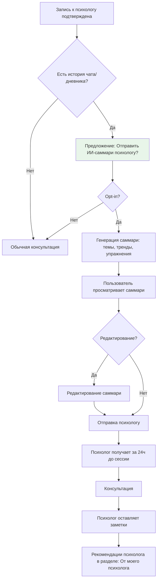

#### Happy Path (пошаговый)

| Шаг | Экран | Действие | Система |
|-----|-------|----------|---------|
| 1 | Подтверждение записи | Видит предложение отправить саммари | «Хотите отправить ИИ-саммари психологу?» |
| 2 | Opt-in | Тап «Да, отправить» | Генерация: темы чата, тренды дневника, КПТ-прогресс |
| 3 | Просмотр | Читает и при необходимости редактирует | Предпросмотр саммари |
| 4 | — | Тап «Отправить» | Психолог получает саммари в панели |
| 5 | После консультации | Видит рекомендации от психолога | Раздел «От моего психолога» |

---

### UF-COURSES: Мини-курсы

**Связь с US:** US-042, US-043
**Связь с FR:** FR-016
**Приоритет:** P1
**Actors:** Дмитрий (P2)

#### Entry Points

| Источник | Действие |
|----------|----------|
| Главный экран | «Обучение» / «Мини-курсы» |
| UF-CHAT | ИИ рекомендует курс |

#### Exit Points

| Результат | Переход |
|-----------|---------|
| Урок пройден | Обновление прогресса |
| Курс завершён | Достижение + рекомендация следующего |

#### Mermaid-диаграмма

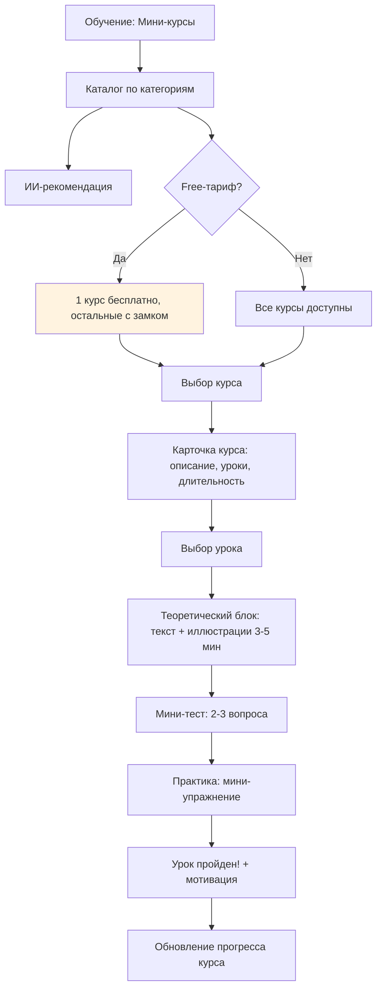

#### Happy Path (пошаговый)

| Шаг | Экран | Действие пользователя | Действие системы |
|-----|-------|----------------------|------------------|
| 1 | Каталог | Просматривает курсы | ИИ-рекомендация сверху |
| 2 | Курс | Тап на курс | Описание, кол-во уроков, прогресс |
| 3 | Урок | Читает теорию (3-5 мин) | Текст + иллюстрации |
| 4 | Тест | Отвечает на 2-3 вопроса | Фидбек по ответам |
| 5 | Практика | Выполняет мини-упражнение | Пошаговый интерфейс |
| 6 | Результат | Видит «Урок пройден!» | Обновление прогресса, достижение |

#### Edge Cases

| Кейс | Обработка |
|------|-----------|
| Free: 1 курс бесплатно | «Основы КПТ» бесплатно, остальные: «Доступно на Standard/Premium» |
| Прерывание урока | Прогресс сохраняется, продолжение с места остановки |

---

### UF-REFERRAL: Реферальная программа

**Связь с US:** US-044
**Связь с FR:** FR-017
**Приоритет:** P1
**Actors:** Аня (P1)

#### Entry Points

| Источник | Действие |
|----------|----------|
| Профиль | «Пригласить друга» |
| Главный экран | Баннер реферальной программы |

#### Exit Points

| Результат | Переход |
|-----------|---------|
| Ссылка отправлена | Ожидание активации |
| Бонус получен | Push-уведомление |

#### Mermaid-диаграмма

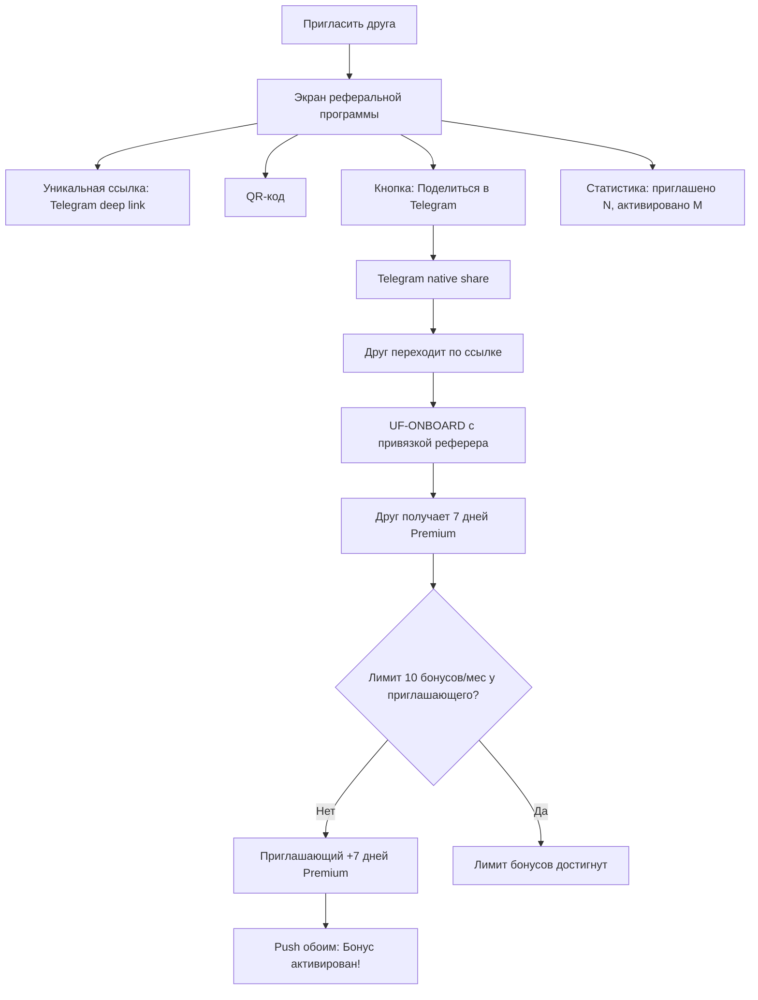

#### Happy Path (пошаговый)

| Шаг | Экран | Действие пользователя | Действие системы |
|-----|-------|----------------------|------------------|
| 1 | Профиль | Тап «Пригласить друга» | Генерация ссылки и QR |
| 2 | Реферал | Тап «Поделиться в Telegram» | Telegram native share sheet |
| 3 | — | Друг переходит по ссылке | Онбординг с привязкой реферера |
| 4 | — | — | Бонус обоим: +7 дней Premium |
| 5 | Push | Видит «Бонус активирован!» | Обновление статистики |

#### Edge Cases

| Кейс | Обработка |
|------|-----------|
| 10 бонусов/мес (CON) | «Лимит бонусов достигнут. Новые бонусы с [дата]» (друг всё равно получает бонус) |
| Друг уже зарегистрирован | «Этот пользователь уже зарегистрирован» — бонус не начисляется |

---

### UF-GAMIFICATION: Геймификация

**Связь с US:** US-045, US-046, US-047
**Связь с FR:** FR-018
**Приоритет:** P1
**Actors:** Олег (P4), Дмитрий (P2)

#### Entry Points

| Источник | Действие |
|----------|----------|
| Главный экран | Виджет «Дерево здоровья» |
| Профиль | Раздел «Достижения» |

#### Exit Points

| Результат | Переход |
|-----------|---------|
| Просмотр прогресса | Возврат на главный экран |
| Открыто достижение | Анимация + уведомление |

#### Mermaid-диаграмма

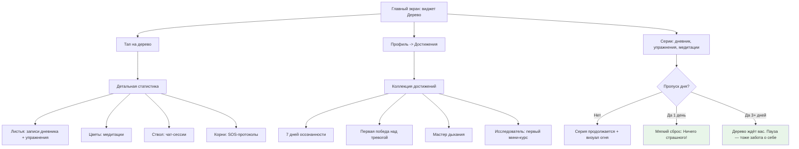

#### Happy Path (пошаговый)

| Шаг | Экран | Действие пользователя | Действие системы |
|-----|-------|----------------------|------------------|
| 1 | Главный | Видит дерево, оно подросло | Визуализация прогресса за сегодня |
| 2 | Дерево | Тап на дерево | Детальная статистика: листья, цветы, ствол |
| 3 | Достижения | Просматривает коллекцию | Открытые и закрытые достижения |
| 4 | — | Выполняет действие (запись, упражнение) | Анимация роста дерева, уведомление о достижении |
| 5 | Серии | Просматривает серии | Дневник: X дней, Упражнения: Y дней, Медитации: Z дней |

#### Edge Cases

| Кейс | Обработка |
|------|-----------|
| Пауза 1 день | Серия мягко сбрасывается: «Ничего страшного! Начните новую серию» |
| Пауза 3+ дней | «Дерево ждёт вас. Пауза — это тоже забота о себе. Готовы продолжить?» (guilt-free) |
| Рекорд серии | Сохраняется навсегда: «Ваш рекорд: X дней» |
| Достижение 7/14/30 дней | Бонусное достижение + анимация |

---

## 7. Сводная таблица

| ID | Flow | Эпик | Приоритет | US | Actors | Entry Points | Exit Points | Error Paths |
|----|------|------|-----------|-----|--------|--------------|-------------|-------------|
| UF-SOS | SOS-протоколы | SOS | P0 Safety | US-038, US-039 | Аня, Олег | FAB, push, чат | Дневник, UF-CRISIS | Оффлайн, кризис |
| UF-CRISIS | Кризис-детектор | Safety | P0 Safety | US-017 | Все | Чат, голос, дневник | Горячая линия, специалист | False positive, ночь |
| UF-ONBOARD | Регистрация | Онбординг | P0 | US-001—004 | Все новые | Bot, deep link, B2B | Главный экран | OAuth, disclaimer, опросник |
| UF-CHAT | AI-чат | Чат 24/7 | P0 | US-005—007 | Аня, Дмитрий, Олег | Таб, push, deep link | Саммари, UF-CRISIS | Лимит Free, потеря связи |
| UF-VOICE | Голосовые сессии | Голос | P0 | US-008—009 | Дмитрий | Кнопка в чате | Транскрипция | Шум, нет микрофона |
| UF-DIARY | Дневник эмоций | Дневник | P0 | US-010—013 | Олег, Аня | Таб, push, чат, SOS | Timeline, аналитика | Лимит Free, пустая запись |
| UF-CBT | КПТ-упражнения | КПТ | P0 | US-014—016 | Дмитрий, Аня | Таб, чат, push | Дневник, прогресс | Прерывание, лимит Free |
| UF-MARKETPLACE | Маркетплейс | Маркетплейс | P0 | US-018—021 | Олег, Елена | Кнопка, чат, кризис | Запись, оплата | Нет слотов, отмена |
| UF-MEDITATION | Медитации | Медитации | P0 | US-022—024 | Аня | Таб, SOS, wearables | Оценка | Прерывание, оффлайн |
| UF-WEARABLES | Wearables | Wearables | P0 | US-025—027 | Дмитрий | Профиль | Стресс-алерт | Нет устройства, потеря связи |
| UF-PAYMENT | Подписки | Платежи | P0 | US-028—029 | Дмитрий, Аня | Онбординг, paywall | Активация тарифа | Ошибка оплаты, отмена |
| UF-B2B | Корпоративное | B2B | P0 | US-030—031 | Марина | B2B-раздел | Аналитика | Увольнение, < 10 чел. |
| UF-PROFILE | Профиль | Профиль | P0 | US-032—034 | Олег, Аня | Таб | Настройки, удаление | Большой экспорт |
| UF-LIMITS | Лимиты | Лимиты | P0 | US-035—037 | Сергей, Аня | Админ-панель | Degradation | Кризис при degradation |
| UF-BRIDGE | Терап. мост | Мост | P1 | US-040—041 | Олег, Елена | После записи | Саммари психологу | Отказ от саммари |
| UF-COURSES | Мини-курсы | Курсы | P1 | US-042—043 | Дмитрий | Обучение, чат | Прогресс | Лимит Free |
| UF-REFERRAL | Реферальная | Реферальная | P1 | US-044 | Аня | Профиль | Бонус | Лимит 10/мес |
| UF-GAMIFICATION | Геймификация | Геймификация | P1 | US-045—047 | Олег, Дмитрий | Виджет, профиль | Достижения | Пауза guilt-free |

### Статистика

| Параметр | Значение |
|----------|----------|
| Всего User Flows | 18 |
| Safety-Critical | 2 (UF-SOS, UF-CRISIS) |
| P0 Flows | 14 |
| P1 Flows | 4 |
| Mermaid-диаграмм | 18 |
| Error Paths | 36+ (минимум 2 на flow) |
| Покрытие US | 47/47 (100%) |
| Покрытие персон | 6/6 (100%) |

---

## 8. Детализация ключевых переходов между flow

### 8.1 Матрица переходов

Описывает, как flow связаны друг с другом и при каких условиях происходит переключение.

| Из flow | В flow | Триггер | Условие | Сохранение контекста |
|---------|--------|---------|---------|---------------------|
| UF-CHAT | UF-CRISIS | Кризис-детектор: critical | Автоматически, каждое сообщение | Да, сессия сохранена |
| UF-CHAT | UF-VOICE | Кнопка «Голос» | Тариф Standard/Premium | Да, контекст беседы |
| UF-CHAT | UF-CBT | ИИ рекомендует упражнение | Пользователь согласен | Да, ссылка на сессию |
| UF-CHAT | UF-MARKETPLACE | ИИ предлагает специалиста | Пользователь согласен | Да, контекст для рекомендации |
| UF-CHAT | UF-DIARY | Предложение записать после сессии | Сессия завершена | Да, данные сессии |
| UF-SOS | UF-CRISIS | Кризис-детектор: critical | Автоматически | Да, протокол прерван |
| UF-SOS | UF-DIARY | Автозапись после протокола | Протокол завершён | Да, оценки до/после |
| UF-VOICE | UF-CHAT | Переключение на текст | Тап кнопки или ошибка STT | Да, транскрипция |
| UF-DIARY | UF-CHAT | «Обсудить с ИИ» | Тап на кнопку в записи | Да, контекст записи |
| UF-CBT | UF-DIARY | Сохранение результата | Упражнение завершено | Да, оценки |
| UF-MARKETPLACE | UF-BRIDGE | Запись подтверждена | Есть история чата/дневника | Да, данные для саммари |
| UF-MARKETPLACE | UF-PAYMENT | Оплата консультации | Тап «Оплатить» | Да, ID бронирования |
| UF-WEARABLES | UF-MEDITATION | Стресс-алерт | HRV < порога | Нет, новый контекст |
| UF-ONBOARD | UF-PAYMENT | Выбор платного тарифа | Тап Standard/Premium | Да, данные профиля |
| UF-LIMITS | UF-CHAT | Graceful degradation | Лимит 100% | Частичный (очередь) |
| UF-GAMIFICATION | UF-DIARY | Просмотр статистики | Тап на метрику | Да, фильтр по типу |

### 8.2 Глобальные элементы интерфейса

Элементы, присутствующие на всех экранах WebApp и влияющие на каждый flow.

#### SOS Floating Action Button (FAB)

```
Расположение: правый нижний угол, position: fixed
Размер: 56x56 dp
Цвет: красный (#D32F2F) с белой иконкой
z-index: 9999 (поверх всего контента, кроме кризис-overlay)
Отступ от edges: 16dp

Поведение:
  - Всегда видна на всех экранах (кроме полноэкранных медитаций)
  - При скролле: остаётся на месте
  - При нажатии: haptic feedback + переход в UF-SOS
  - Не перекрывает MainButton Telegram
  - На экранах SOS и CRISIS: скрывается (уже в соответствующем flow)
```

#### Bottom Navigation

```
Расположение: нижняя часть экрана, над MainButton
Элементы: 4 таба
  - Чат (иконка сообщения)
  - Дневник (иконка дневника)
  - Практики (иконка мозга / lotus)
  - Профиль (иконка пользователя)

Поведение:
  - Активный таб подсвечен
  - Badge на табе Чат: кол-во непрочитанных рекомендаций
  - Badge на табе Практики: «новое» при рекомендации ИИ
  - Скрывается: при открытии клавиатуры, в полноэкранных режимах (медитация, SOS)
```

#### Disclaimer Mini-Banner

```
Расположение: нижняя часть терапевтических экранов
Текст: «Не является медицинской услугой» (CON-010)
Экраны: чат, голос, дневник, упражнения, SOS, медитации, курсы
Поведение:
  - Compact-режим: одна строка, тап раскрывает полный текст
  - Не мешает основному контенту
  - Не закрывает MainButton
```

### 8.3 Состояния загрузки и скелетоны

Для каждого flow определены промежуточные состояния для соблюдения H1 (видимость статуса системы).

| Flow | Состояние загрузки | Скелетон | Время |
|------|-------------------|----------|-------|
| UF-CHAT | «ИИ думает...» с анимированными точками | Bubble placeholder | < 2 сек (first token) |
| UF-VOICE | «Распознаю речь...» / «ИИ думает...» / «ИИ говорит...» | Waveform animation | STT < 3 сек, TTS < 2 сек |
| UF-DIARY | Spinner на кнопке «Сохранить» | Timeline placeholder | < 1 сек |
| UF-CBT | Progress bar между шагами | Step placeholder | < 1 сек |
| UF-MARKETPLACE | Skeleton cards в каталоге | Card placeholder | < 2 сек |
| UF-MEDITATION | «Загрузка аудио...» с progress bar | Player placeholder | < 3 сек |
| UF-SOS | Нет загрузки (мгновенный доступ) | — | 0 сек (кэш) |
| UF-PAYMENT | Spinner + «Обработка платежа...» | — | Зависит от YooKassa |

### 8.4 Обработка оффлайн-режима по flow

| Flow | Оффлайн-доступ | Что работает | Что не работает |
|------|----------------|--------------|-----------------|
| UF-SOS | Да (кэш) | Дыхание, grounding (визуал + текст) | TTS, запись в дневник (синхронизация позже) |
| UF-CRISIS | Частично | Показ горячей линии (tel: link работает) | Оповещение оператора (отложенное) |
| UF-CHAT | Нет | — | Все функции (требует LLM API) |
| UF-VOICE | Нет | — | Все функции (требует STT/TTS/LLM) |
| UF-DIARY | Частично | Создание записи (локально) | Синхронизация, ИИ-анализ |
| UF-CBT | Частично | Просмотр начатых упражнений | Начало новых (требует рекомендацию ИИ) |
| UF-MEDITATION | Частично | Дыхательные анимации (CSS) | Аудио-медитации |
| UF-MARKETPLACE | Нет | — | Все функции (требует API) |
| UF-GAMIFICATION | Частично | Просмотр кэшированного дерева | Обновление в реальном времени |
| UF-PROFILE | Частично | Просмотр кэшированных настроек | Изменение настроек |

---

## 9. Accessibility и инклюзивность

### 9.1 Требования доступности

| Требование | Реализация во flow | Приоритет |
|------------|-------------------|-----------|
| Контрастность текста >= 4.5:1 | Все экраны, особенно кризисный overlay | P0 |
| Увеличенный шрифт | Поддержка системных настроек масштабирования | P0 |
| Screen reader | Aria-labels для всех интерактивных элементов | P1 |
| Одноручное управление | SOS FAB доступен одним пальцем, нет необходимости в двуручных жестах | P0 |
| Цветовая слепота | Дополнительные индикаторы (иконки, текст) к цветовым сигналам в палитре эмоций | P1 |
| Крупные области нажатия | Все кнопки >= 44x44 dp, особенно SOS кнопка | P0 |
| Минимальное время отклика | Timeout на действия >= 5 секунд, нет автоматического закрытия важных экранов | P0 |

### 9.2 Адаптация для персон

| Персона | Особенности UX | Адаптация |
|---------|----------------|-----------|
| Аня (паника, 2 часа ночи) | Трясущиеся руки, сниженное внимание | Крупные кнопки в SOS, минимум шагов, тёмная тема ночью |
| Дмитрий (занят, 10 мин) | Мало времени, нетерпеливость | Быстрый доступ к упражнениям, таймеры, прогресс |
| Марина (HR, дашборд) | Ориентация на данные и цифры | Графики, сравнения, экспорт в PDF |
| Олег (регион, слабый интернет) | Низкая скорость сети | Оффлайн-режим, лёгкие страницы, кэширование |

---

## 10. Метрики UX по flow

Определение ключевых UX-метрик для каждого flow, позволяющих оценить качество пользовательского опыта.

| Flow | Метрика | Target | Метод измерения |
|------|---------|--------|-----------------|
| UF-SOS | Время от тапа до первого шага протокола | < 2 сек | Аналитика: timestamp tap -> first_step |
| UF-SOS | Completion rate протокола | > 70% | % завершённых из начатых |
| UF-SOS | Улучшение оценки (после vs до) | > 2 пункта | Среднее (оценка_после - оценка_до) |
| UF-CRISIS | False negative rate | < 1% | Аудит размеченных данных |
| UF-CRISIS | Время от определения до overlay | < 1 сек | Аналитика: timestamp detect -> overlay |
| UF-ONBOARD | Completion rate онбординга | > 80% | % завершивших все шаги |
| UF-ONBOARD | Время прохождения | < 3 мин | Медианное время start -> main_screen |
| UF-ONBOARD | Drop-off на disclaimer | < 10% | % отказавшихся на disclaimer |
| UF-CHAT | Среднее кол-во сообщений за сессию | > 5 | Среднее по всем сессиям |
| UF-CHAT | CSAT (оценка сессии) | > 4.0/5 | Средняя оценка |
| UF-CHAT | Время до aha-момента | < 3 сообщения | Анализ первых сессий |
| UF-DIARY | DAU по дневнику | > 30% MAU | Ежедневные уникальные записи |
| UF-DIARY | Среднее кол-во записей/неделя | > 4 | Среднее по активным пользователям |
| UF-CBT | Completion rate упражнения | > 60% | % завершённых из начатых |
| UF-CBT | Повторное использование | > 40% | % пользователей, сделавших 2+ упражнения |
| UF-MARKETPLACE | Конверсия каталог -> запись | > 5% | % записавшихся из просмотревших |
| UF-MEDITATION | Completion rate медитации | > 80% | % дослушавших до конца |
| UF-PAYMENT | Trial -> Paid conversion | > 30% | % оплативших после trial |
| UF-PAYMENT | Churn rate (месячный) | < 10% | % отписавшихся за месяц |
| UF-REFERRAL | Viral coefficient | > 0.3 | Среднее кол-во приглашённых на пользователя |
| UF-GAMIFICATION | Средняя длина серии | > 5 дней | Среднее по всем серийным пользователям |

---

## 11. Глоссарий терминов

| Термин | Определение |
|--------|-----------|
| FAB | Floating Action Button — плавающая кнопка действия, закреплённая на экране |
| Flow | Пользовательский сценарий от точки входа до точки выхода |
| Happy Path | Основной успешный сценарий без ошибок и отклонений |
| Error Path | Сценарий обработки ошибки или нештатной ситуации |
| Edge Case | Граничный случай, требующий особой обработки |
| Entry Point | Точка входа в flow (откуда пользователь попадает) |
| Exit Point | Точка выхода из flow (куда пользователь переходит) |
| Overlay | Полноэкранный слой поверх основного контента |
| Non-dismissible | Overlay, который нельзя закрыть свайпом или кнопкой «Назад» |
| Graceful degradation | Плавное ухудшение функциональности при ограничениях |
| Streaming output | Посимвольный вывод текста ответа ИИ |
| Skeleton | Placeholder-анимация загрузки в форме будущего контента |
| Deep link | Ссылка, открывающая конкретный экран WebApp |
| CloudStorage | Telegram WebApp API для локального хранения данных (до 1 МБ) |
| MainButton | Основная кнопка действия в Telegram WebApp SDK |
| BackButton | Программная кнопка «Назад» в Telegram WebApp SDK |
| HapticFeedback | Тактильная обратная связь через вибрацию устройства |
| PMR | Progressive Muscle Relaxation — прогрессивная мышечная релаксация |
| Grounding | Техника заземления 5-4-3-2-1 для снижения тревоги |
| КПТ | Когнитивно-поведенческая терапия |
| STT | Speech-to-Text — преобразование речи в текст |
| TTS | Text-to-Speech — преобразование текста в речь |
| HRV | Heart Rate Variability — вариабельность сердечного ритма |
| Guilt-free | Подход без чувства вины: мягкие сбросы серий, позитивные сообщения при паузах |
| RAG | Retrieval-Augmented Generation — генерация с дополнением из базы знаний |
| Paywall | Экран предложения платного тарифа при попытке доступа к закрытой функции |
| Drop-off | Отток пользователей на определённом шаге flow |
| Aha-момент | Момент, когда пользователь осознаёт ценность продукта |
| Wizard-pattern | Пошаговый интерфейс с прогресс-баром для многоэтапных действий |
| Bottom-sheet | Выдвижная панель снизу экрана для дополнительных действий (фильтры, настройки) |
| Chip-group | Группа интерактивных чипов (тегов) для выбора одного или нескольких значений |
| Lazy loading | Загрузка данных по мере необходимости (при скролле или переходе) |
| Badge | Маркер на иконке навигации, указывающий на новые элементы или уведомления |
| Toggle | Переключатель между двумя состояниями (вкл/выкл, текст/голос) |
| Toast | Краткое всплывающее уведомление внизу экрана (не блокирует взаимодействие) |
| CSAT | Customer Satisfaction Score — оценка удовлетворённости пользователя |
| DAU | Daily Active Users — ежедневные активные пользователи |
| MAU | Monthly Active Users — ежемесячные активные пользователи |

---

## 12. Примечания к реализации

### 12.1 Приоритет реализации flow

Рекомендуемый порядок реализации flow для MVP:

1. **UF-CRISIS** (Safety-Critical) — обязательно до запуска, блокирует релиз
2. **UF-SOS** (Safety-Critical) — обязательно до запуска, блокирует релиз
3. **UF-ONBOARD** — точка входа, без неё ничего не работает
4. **UF-CHAT** — core-функция, ключевая ценность продукта
5. **UF-DIARY** — второй по важности daily use case, retention driver
6. **UF-PAYMENT** — монетизация, необходима для платных функций
7. **UF-CBT** — расширяет терапевтическую ценность
8. **UF-MEDITATION** — дополняет набор практик
9. **UF-VOICE** — Premium-драйвер
10. **UF-MARKETPLACE** — канал эскалации к живым специалистам
11. **UF-PROFILE** — управление аккаунтом, ФЗ-152 compliance
12. **UF-LIMITS** — контроль расходов (нужен до открытого запуска)
13. **UF-B2B** — стратегический канал, можно после основного MVP
14. **UF-WEARABLES** — Premium-фича, можно отложить
15. **UF-GAMIFICATION** (P1) — retention, после стабилизации core
16. **UF-COURSES** (P1) — engagement, после core
17. **UF-BRIDGE** (P1) — дифференциатор маркетплейса
18. **UF-REFERRAL** (P1) — виральный рост, после product-market fit

### 12.2 Зависимости между flow

```
UF-ONBOARD ──────────> [Все остальные flow]
UF-CRISIS  ──────────> UF-CHAT, UF-VOICE, UF-SOS, UF-DIARY (параллельный)
UF-PAYMENT ──────────> UF-VOICE, UF-WEARABLES, UF-MEDITATION (полный каталог)
UF-CHAT    ──────────> UF-VOICE (переключение)
UF-MARKETPLACE ──────> UF-BRIDGE (после записи)
UF-DIARY   ──────────> UF-GAMIFICATION (данные для дерева)
UF-CBT     ──────────> UF-GAMIFICATION (данные для дерева)
```

---

*Документ создан: UX Agent | Дата: 2026-02-04*
